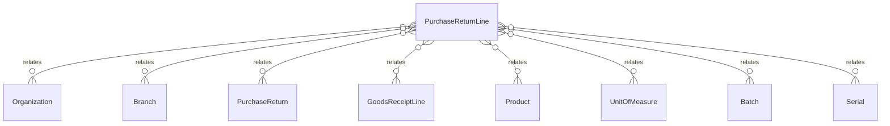

# `PurchaseReturnLine` → `purchase_return_lines`

<!-- generated by .kb/generate.mjs — do not edit by hand -->

Declared at `packages/db/prisma/schema/procurement.prisma:1117`.

| property | value |
| --- | --- |
| table | `purchase_return_lines` |
| tenant-scoped | yes — has `organizationId` |
| RLS | `visible` policy |
| columns | 19 |
| relations | 8 |

## Columns

| column | type | definition |
| --- | --- | --- |
| `id` | `String` | `id String @id @default(uuid()) @db.Uuid` |
| `organizationId` | `String` | `organizationId String @map("organization_id") @db.Uuid` |
| `branchId` | `String` | `branchId String @map("branch_id") @db.Uuid` |
| `purchaseReturnId` | `String` | `purchaseReturnId String @map("purchase_return_id") @db.Uuid` |
| `lineNumber` | `Int` | `lineNumber Int @map("line_number") @db.SmallInt` |
| `goodsReceiptLineId` | `String?` | `goodsReceiptLineId String? @map("goods_receipt_line_id") @db.Uuid` |
| `productId` | `String` | `productId String @map("product_id") @db.Uuid` |
| `batchId` | `String?` | `batchId String? @map("batch_id") @db.Uuid` |
| `serialId` | `String?` | `serialId String? @map("serial_id") @db.Uuid` |
| `quantityBase` | `Decimal` | `quantityBase Decimal @map("quantity_base") @db.Decimal(18, 6)` |
| `quantityEntered` | `Decimal` | `quantityEntered Decimal @map("quantity_entered") @db.Decimal(18, 6)` |
| `unitId` | `String` | `unitId String @map("unit_id") @db.Uuid` |
| `statusFrom` | `StockStatus` | `statusFrom StockStatus @map("status_from")` |
| `unitCostBase` | `BigInt?` | `unitCostBase BigInt? @map("unit_cost_base") @db.BigInt` |
| `currency` | `String?` | `currency String? @db.Char(3)` |
| `lineTotalMinor` | `BigInt` | `lineTotalMinor BigInt @default(0) @map("line_total_minor") @db.BigInt` |
| `notes` | `String?` | `notes String? @db.Text` |
| `createdAt` | `DateTime` | `createdAt DateTime @default(now()) @map("created_at") @db.Timestamptz(6)` |
| `updatedAt` | `DateTime` | `updatedAt DateTime @updatedAt @map("updated_at") @db.Timestamptz(6)` |

## Relations

| field | target | definition |
| --- | --- | --- |
| `organization` | [`Organization`](Organization.md) | `organization Organization @relation(fields: [organizationId], references: [id], onDelete: Cascade)` |
| `branch` | [`Branch`](Branch.md) | `branch Branch @relation(fields: [organizationId, branchId], references: [organizationId, id], onDelete: Cascade)` |
| `purchaseReturn` | [`PurchaseReturn`](PurchaseReturn.md) | `purchaseReturn PurchaseReturn @relation(fields: [organizationId, purchaseReturnId], references: [organizationId, id], onDelete: Cascade)` |
| `goodsReceiptLine` | [`GoodsReceiptLine`](GoodsReceiptLine.md) | `goodsReceiptLine GoodsReceiptLine? @relation(fields: [organizationId, goodsReceiptLineId], references: [organizationId, id], onDelete: Restrict)` |
| `product` | [`Product`](Product.md) | `product Product @relation(fields: [productId], references: [id], onDelete: Restrict)` |
| `unit` | [`UnitOfMeasure`](UnitOfMeasure.md) | `unit UnitOfMeasure @relation("PurchaseReturnLineUnit", fields: [unitId], references: [id], onDelete: Restrict)` |
| `batch` | [`Batch`](Batch.md) | `batch Batch? @relation("PurchaseReturnLineBatch", fields: [organizationId, branchId, batchId], references: [organizationId, branchId, id], onDelete: Restrict)` |
| `serial` | [`Serial`](Serial.md) | `serial Serial? @relation("PurchaseReturnLineSerial", fields: [organizationId, branchId, serialId], references: [organizationId, branchId, id], onDelete: Restrict)` |

## Indexes and constraints

- `@@unique([organizationId, purchaseReturnId, productId, batchId, serialId])`
- `@@unique([organizationId, purchaseReturnId, lineNumber])`
- `@@unique([organizationId, id])`
- `@@index([organizationId, purchaseReturnId])`
- `@@index([organizationId, productId])`
- `@@index([organizationId, goodsReceiptLineId])`

## Neighbourhood

