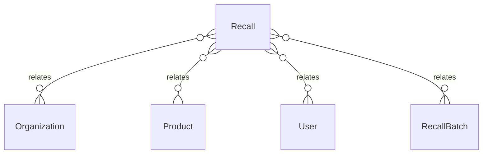

# `Recall` → `recalls`

<!-- generated by .kb/generate.mjs — do not edit by hand -->

Declared at `packages/db/prisma/schema/recall.prisma:143`.

| property | value |
| --- | --- |
| table | `recalls` |
| tenant-scoped | yes — has `organizationId` |
| RLS | **MISSING — this is a tenant-isolation defect** |
| columns | 20 |
| relations | 6 |

## Columns

| column | type | definition |
| --- | --- | --- |
| `id` | `String` | `id String @id @default(uuid()) @db.Uuid` |
| `organizationId` | `String` | `organizationId String @map("organization_id") @db.Uuid` |
| `reference` | `String` | `reference String @db.VarChar(64)` |
| `productId` | `String` | `productId String @map("product_id") @db.Uuid` |
| `title` | `String` | `title String @db.VarChar(255)` |
| `classification` | `RecallClassification` | `classification RecallClassification @default(UNCLASSIFIED)` |
| `source` | `RecallSource` | `source RecallSource` |
| `noticeReference` | `String?` | `noticeReference String? @map("notice_reference") @db.VarChar(128)` |
| `noticeOn` | `DateTime?` | `noticeOn DateTime? @map("notice_on") @db.Date` |
| `reason` | `String` | `reason String @db.Text` |
| `status` | `RecallStatus` | `status RecallStatus @default(DRAFT)` |
| `raisedById` | `String` | `raisedById String @map("raised_by_id") @db.Uuid` |
| `executedAt` | `DateTime?` | `executedAt DateTime? @map("executed_at") @db.Timestamptz(6)` |
| `executedById` | `String?` | `executedById String? @map("executed_by_id") @db.Uuid` |
| `closedAt` | `DateTime?` | `closedAt DateTime? @map("closed_at") @db.Timestamptz(6)` |
| `closedById` | `String?` | `closedById String? @map("closed_by_id") @db.Uuid` |
| `outcomeNote` | `String?` | `outcomeNote String? @map("outcome_note") @db.Text` |
| `notes` | `String?` | `notes String? @db.Text` |
| `createdAt` | `DateTime` | `createdAt DateTime @default(now()) @map("created_at") @db.Timestamptz(6)` |
| `updatedAt` | `DateTime` | `updatedAt DateTime @updatedAt @map("updated_at") @db.Timestamptz(6)` |

## Relations

| field | target | definition |
| --- | --- | --- |
| `organization` | [`Organization`](Organization.md) | `organization Organization @relation(fields: [organizationId], references: [id], onDelete: Cascade)` |
| `product` | [`Product`](Product.md) | `product Product @relation("RecallProduct", fields: [productId], references: [id], onDelete: Restrict)` |
| `raisedBy` | [`User`](User.md) | `raisedBy User @relation("RecallRaisedBy", fields: [raisedById], references: [id], onDelete: Restrict)` |
| `executedBy` | [`User`](User.md) | `executedBy User? @relation("RecallExecutedBy", fields: [executedById], references: [id], onDelete: Restrict)` |
| `closedBy` | [`User`](User.md) | `closedBy User? @relation("RecallClosedBy", fields: [closedById], references: [id], onDelete: Restrict)` |
| `batches` | [`RecallBatch`](RecallBatch.md) | `batches RecallBatch[]` |

## Indexes and constraints

- `@@unique([organizationId, reference])`
- `@@unique([organizationId, id])`
- `@@index([organizationId, status, createdAt(sort: Desc)])`
- `@@index([organizationId, productId])`

## Neighbourhood

