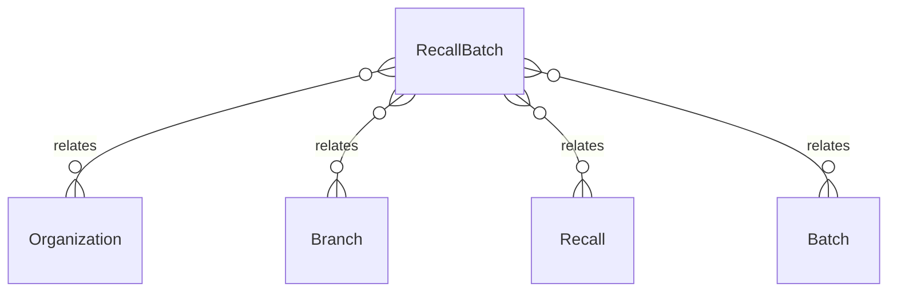

# `RecallBatch` → `recall_batches`

<!-- generated by .kb/generate.mjs — do not edit by hand -->

Declared at `packages/db/prisma/schema/recall.prisma:214`.

| property | value |
| --- | --- |
| table | `recall_batches` |
| tenant-scoped | yes — has `organizationId` |
| RLS | `branch` policy |
| columns | 13 |
| relations | 4 |

## Columns

| column | type | definition |
| --- | --- | --- |
| `id` | `String` | `id String @id @default(uuid()) @db.Uuid` |
| `organizationId` | `String` | `organizationId String @map("organization_id") @db.Uuid` |
| `branchId` | `String` | `branchId String @map("branch_id") @db.Uuid` |
| `recallId` | `String` | `recallId String @map("recall_id") @db.Uuid` |
| `batchId` | `String` | `batchId String @map("batch_id") @db.Uuid` |
| `lotNumber` | `String` | `lotNumber String @map("lot_number") @db.VarChar(128)` |
| `status` | `RecallBatchStatus` | `status RecallBatchStatus @default(PENDING)` |
| `quantityHeldBase` | `Decimal?` | `quantityHeldBase Decimal? @map("quantity_held_base") @db.Decimal(18, 6)` |
| `heldAt` | `DateTime?` | `heldAt DateTime? @map("held_at") @db.Timestamptz(6)` |
| `releasedAt` | `DateTime?` | `releasedAt DateTime? @map("released_at") @db.Timestamptz(6)` |
| `outcomeNote` | `String?` | `outcomeNote String? @map("outcome_note") @db.Text` |
| `createdAt` | `DateTime` | `createdAt DateTime @default(now()) @map("created_at") @db.Timestamptz(6)` |
| `updatedAt` | `DateTime` | `updatedAt DateTime @updatedAt @map("updated_at") @db.Timestamptz(6)` |

## Relations

| field | target | definition |
| --- | --- | --- |
| `organization` | [`Organization`](Organization.md) | `organization Organization @relation(fields: [organizationId], references: [id], onDelete: Cascade)` |
| `branch` | [`Branch`](Branch.md) | `branch Branch @relation(fields: [organizationId, branchId], references: [organizationId, id], onDelete: Cascade)` |
| `recall` | [`Recall`](Recall.md) | `recall Recall @relation(fields: [organizationId, recallId], references: [organizationId, id], onDelete: Cascade)` |
| `batch` | [`Batch`](Batch.md) | `batch Batch @relation("RecallBatchBatch", fields: [organizationId, branchId, batchId], references: [organizationId, branchId, id], onDelete: Restrict)` |

## Indexes and constraints

- `@@unique([organizationId, recallId, batchId])`
- `@@unique([organizationId, id])`
- `@@index([organizationId, batchId])`
- `@@index([organizationId, branchId, status])`

## Neighbourhood

