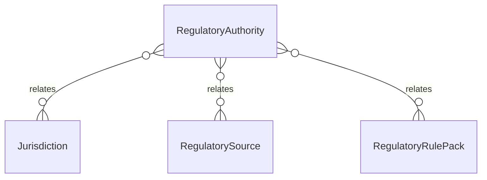

# `RegulatoryAuthority` → `regulatory_authorities`

<!-- generated by .kb/generate.mjs — do not edit by hand -->

Declared at `packages/db/prisma/schema/regulatory.prisma:275`.

| property | value |
| --- | --- |
| table | `regulatory_authorities` |
| tenant-scoped | no |
| RLS | exempt — a regulator is a public body, not a clinic — platform reference data, guarded by the platform_law_not_tenant_writable t… |
| columns | 9 |
| relations | 3 |

## Columns

| column | type | definition |
| --- | --- | --- |
| `id` | `String` | `id String @id @default(uuid()) @db.Uuid` |
| `jurisdictionId` | `String` | `jurisdictionId String @map("jurisdiction_id") @db.Uuid` |
| `code` | `String` | `code String @db.VarChar(64)` |
| `name` | `String` | `name String @db.VarChar(255)` |
| `websiteUrl` | `String?` | `websiteUrl String? @map("website_url") @db.VarChar(500)` |
| `remit` | `String?` | `remit String? @db.Text` |
| `isActive` | `Boolean` | `isActive Boolean @default(true) @map("is_active")` |
| `createdAt` | `DateTime` | `createdAt DateTime @default(now()) @map("created_at") @db.Timestamptz(6)` |
| `updatedAt` | `DateTime` | `updatedAt DateTime @updatedAt @map("updated_at") @db.Timestamptz(6)` |

## Relations

| field | target | definition |
| --- | --- | --- |
| `jurisdiction` | [`Jurisdiction`](Jurisdiction.md) | `jurisdiction Jurisdiction @relation(fields: [jurisdictionId], references: [id], onDelete: Restrict)` |
| `sources` | [`RegulatorySource`](RegulatorySource.md) | `sources RegulatorySource[]` |
| `rulePacks` | [`RegulatoryRulePack`](RegulatoryRulePack.md) | `rulePacks RegulatoryRulePack[]` |

## Indexes and constraints

- `@@unique([code])`
- `@@index([jurisdictionId, isActive])`

## Neighbourhood

