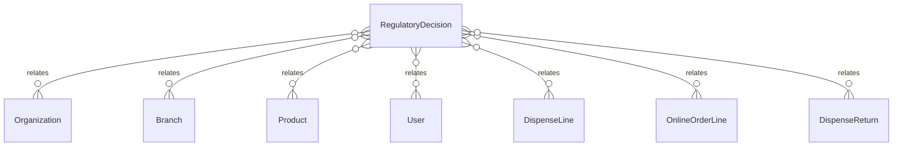

# `RegulatoryDecision` → `regulatory_decisions`

<!-- generated by .kb/generate.mjs — do not edit by hand -->

Declared at `packages/db/prisma/schema/regulatory.prisma:585`.

| property | value |
| --- | --- |
| table | `regulatory_decisions` |
| tenant-scoped | yes — has `organizationId` |
| RLS | `org` policy |
| columns | 18 |
| relations | 7 |

## Columns

| column | type | definition |
| --- | --- | --- |
| `id` | `String` | `id String @id @default(uuid()) @db.Uuid` |
| `organizationId` | `String` | `organizationId String @map("organization_id") @db.Uuid` |
| `branchId` | `String` | `branchId String @map("branch_id") @db.Uuid` |
| `productId` | `String` | `productId String @map("product_id") @db.Uuid` |
| `transaction` | `RegulatoryTransactionType` | `transaction RegulatoryTransactionType` |
| `outcome` | `RegulatoryDecisionOutcome` | `outcome RegulatoryDecisionOutcome` |
| `countryCode` | `String` | `countryCode String @map("country_code") @db.Char(2)` |
| `regionCode` | `String?` | `regionCode String? @map("region_code") @db.VarChar(8)` |
| `lowestPackMaturity` | `RulePackMaturity?` | `lowestPackMaturity RulePackMaturity? @map("lowest_pack_maturity")` |
| `wasEnforced` | `Boolean` | `wasEnforced Boolean @default(false) @map("was_enforced")` |
| `quantityBase` | `Decimal` | `quantityBase Decimal @map("quantity_base") @db.Decimal(18, 6)` |
| `evaluatedAt` | `DateTime` | `evaluatedAt DateTime @map("evaluated_at") @db.Timestamptz(6)` |
| `packVersions` | `Json` | `packVersions Json @map("pack_versions")` |
| `reasons` | `Json` | `reasons Json` |
| `conditions` | `Json` | `conditions Json` |
| `ruleCodes` | `String[]` | `ruleCodes String[] @map("rule_codes")` |
| `actorUserId` | `String` | `actorUserId String @map("actor_user_id") @db.Uuid` |
| `createdAt` | `DateTime` | `createdAt DateTime @default(now()) @map("created_at") @db.Timestamptz(6)` |

## Relations

| field | target | definition |
| --- | --- | --- |
| `organization` | [`Organization`](Organization.md) | `organization Organization @relation(fields: [organizationId], references: [id], onDelete: Cascade)` |
| `branch` | [`Branch`](Branch.md) | `branch Branch @relation(fields: [organizationId, branchId], references: [organizationId, id], onDelete: Cascade)` |
| `product` | [`Product`](Product.md) | `product Product @relation(fields: [productId], references: [id], onDelete: Restrict)` |
| `actor` | [`User`](User.md) | `actor User @relation("RegulatoryDecisionActor", fields: [actorUserId], references: [id], onDelete: Restrict)` |
| `dispenseLines` | [`DispenseLine`](DispenseLine.md) | `dispenseLines DispenseLine[]` |
| `onlineOrderLines` | [`OnlineOrderLine`](OnlineOrderLine.md) | `onlineOrderLines OnlineOrderLine[] @relation("OnlineOrderLineDecision")` |
| `dispenseReturns` | [`DispenseReturn`](DispenseReturn.md) | `dispenseReturns DispenseReturn[]` |

## Indexes and constraints

- `@@unique([organizationId, id])`
- `@@index([organizationId, branchId, evaluatedAt(sort: Desc)])`
- `@@index([organizationId, productId, evaluatedAt(sort: Desc)])`
- `@@index([organizationId, outcome])`

## Neighbourhood

