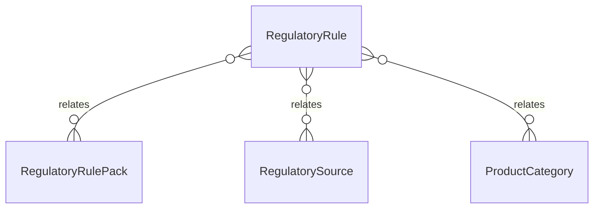

# `RegulatoryRule` → `regulatory_rules`

<!-- generated by .kb/generate.mjs — do not edit by hand -->

Declared at `packages/db/prisma/schema/regulatory.prisma:427`.

| property | value |
| --- | --- |
| table | `regulatory_rules` |
| tenant-scoped | no |
| RLS | exempt — as regulatory_rule_packs — a rule is a statement of law, not a fact about a clinic (see enable-rls.sql) |
| columns | 17 |
| relations | 3 |

## Columns

| column | type | definition |
| --- | --- | --- |
| `id` | `String` | `id String @id @default(uuid()) @db.Uuid` |
| `packId` | `String` | `packId String @map("pack_id") @db.Uuid` |
| `ruleType` | `RegulatoryRuleType` | `ruleType RegulatoryRuleType @map("rule_type")` |
| `code` | `String` | `code String @db.VarChar(64)` |
| `statement` | `String` | `statement String @db.Text` |
| `status` | `RegulatoryRuleStatus` | `status RegulatoryRuleStatus @default(DRAFT)` |
| `appliesToProductType` | `ProductType?` | `appliesToProductType ProductType? @map("applies_to_product_type")` |
| `appliesToCategoryId` | `String?` | `appliesToCategoryId String? @map("applies_to_category_id") @db.Uuid` |
| `appliesToClassification` | `String?` | `appliesToClassification String? @map("applies_to_classification") @db.VarChar(64)` |
| `appliesToTransactions` | `RegulatoryTransactionType[]` | `appliesToTransactions RegulatoryTransactionType[] @map("applies_to_transactions")` |
| `parameters` | `Json` | `parameters Json @db.JsonB` |
| `sourceId` | `String` | `sourceId String @map("source_id") @db.Uuid` |
| `version` | `Int` | `version Int @default(1)` |
| `effectiveFrom` | `DateTime` | `effectiveFrom DateTime @map("effective_from") @db.Date` |
| `effectiveTo` | `DateTime?` | `effectiveTo DateTime? @map("effective_to") @db.Date` |
| `createdAt` | `DateTime` | `createdAt DateTime @default(now()) @map("created_at") @db.Timestamptz(6)` |
| `updatedAt` | `DateTime` | `updatedAt DateTime @updatedAt @map("updated_at") @db.Timestamptz(6)` |

## Relations

| field | target | definition |
| --- | --- | --- |
| `pack` | [`RegulatoryRulePack`](RegulatoryRulePack.md) | `pack RegulatoryRulePack @relation(fields: [packId], references: [id], onDelete: Cascade)` |
| `source` | [`RegulatorySource`](RegulatorySource.md) | `source RegulatorySource @relation(fields: [sourceId], references: [id], onDelete: Restrict)` |
| `appliesToCategory` | [`ProductCategory`](ProductCategory.md) | `appliesToCategory ProductCategory? @relation("RegulatoryRuleCategory", fields: [appliesToCategoryId], references: [id], onDelete: Restrict)` |

## Indexes and constraints

- `@@unique([packId, code, version])`
- `@@index([packId, ruleType, status])`
- `@@index([packId, effectiveFrom])`

## Neighbourhood

