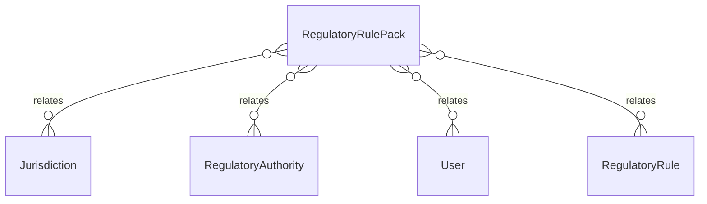

# `RegulatoryRulePack` → `regulatory_rule_packs`

<!-- generated by .kb/generate.mjs — do not edit by hand -->

Declared at `packages/db/prisma/schema/regulatory.prisma:373`.

| property | value |
| --- | --- |
| table | `regulatory_rule_packs` |
| tenant-scoped | no |
| RLS | exempt — the LAW of a jurisdiction, like tax_rule_defaults. Scoping it would return zero rows for every tenant, so every dispens… |
| columns | 16 |
| relations | 4 |

## Columns

| column | type | definition |
| --- | --- | --- |
| `id` | `String` | `id String @id @default(uuid()) @db.Uuid` |
| `jurisdictionId` | `String` | `jurisdictionId String @map("jurisdiction_id") @db.Uuid` |
| `authorityId` | `String` | `authorityId String @map("authority_id") @db.Uuid` |
| `version` | `String` | `version String @db.VarChar(32)` |
| `name` | `String` | `name String @db.VarChar(255)` |
| `description` | `String?` | `description String? @db.Text` |
| `maturity` | `RulePackMaturity` | `maturity RulePackMaturity @default(ARCHITECTURE_SUPPORTED)` |
| `effectiveFrom` | `DateTime` | `effectiveFrom DateTime @map("effective_from") @db.Date` |
| `effectiveTo` | `DateTime?` | `effectiveTo DateTime? @map("effective_to") @db.Date` |
| `lastReviewedAt` | `DateTime?` | `lastReviewedAt DateTime? @map("last_reviewed_at") @db.Timestamptz(6)` |
| `reviewedBy` | `String?` | `reviewedBy String? @map("reviewed_by") @db.VarChar(255)` |
| `reviewedByUserId` | `String?` | `reviewedByUserId String? @map("reviewed_by_user_id") @db.Uuid` |
| `reviewedAt` | `DateTime?` | `reviewedAt DateTime? @map("reviewed_at") @db.Timestamptz(6)` |
| `reviewNotes` | `String?` | `reviewNotes String? @map("review_notes") @db.Text` |
| `createdAt` | `DateTime` | `createdAt DateTime @default(now()) @map("created_at") @db.Timestamptz(6)` |
| `updatedAt` | `DateTime` | `updatedAt DateTime @updatedAt @map("updated_at") @db.Timestamptz(6)` |

## Relations

| field | target | definition |
| --- | --- | --- |
| `jurisdiction` | [`Jurisdiction`](Jurisdiction.md) | `jurisdiction Jurisdiction @relation(fields: [jurisdictionId], references: [id], onDelete: Restrict)` |
| `authority` | [`RegulatoryAuthority`](RegulatoryAuthority.md) | `authority RegulatoryAuthority @relation(fields: [authorityId], references: [id], onDelete: Restrict)` |
| `reviewedByUser` | [`User`](User.md) | `reviewedByUser User? @relation("RulePackReviewer", fields: [reviewedByUserId], references: [id], onDelete: SetNull)` |
| `rules` | [`RegulatoryRule`](RegulatoryRule.md) | `rules RegulatoryRule[]` |

## Indexes and constraints

- `@@unique([jurisdictionId, version])`
- `@@index([jurisdictionId, maturity])`
- `@@index([jurisdictionId, effectiveFrom])`

## Neighbourhood

