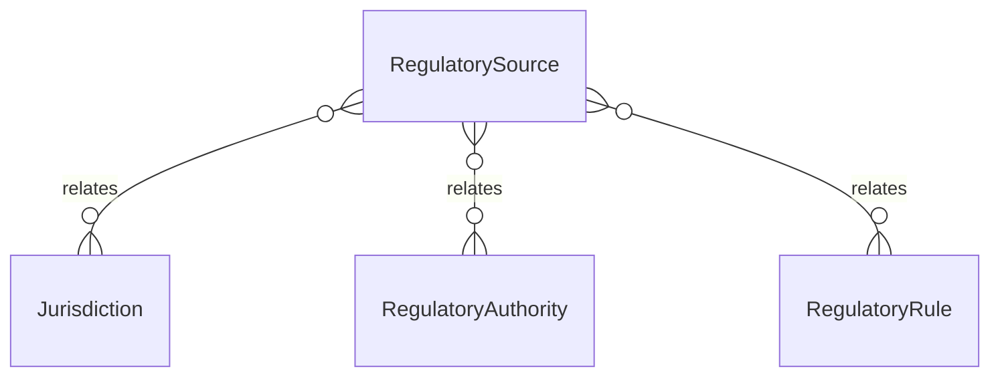

# `RegulatorySource` → `regulatory_sources`

<!-- generated by .kb/generate.mjs — do not edit by hand -->

Declared at `packages/db/prisma/schema/regulatory.prisma:328`.

| property | value |
| --- | --- |
| table | `regulatory_sources` |
| tenant-scoped | no |
| RLS | exempt — the citation registry behind the rules — published documents, identical for every clinic, write-guarded by trigger (see… |
| columns | 14 |
| relations | 3 |

## Columns

| column | type | definition |
| --- | --- | --- |
| `id` | `String` | `id String @id @default(uuid()) @db.Uuid` |
| `jurisdictionId` | `String` | `jurisdictionId String @map("jurisdiction_id") @db.Uuid` |
| `authorityId` | `String` | `authorityId String @map("authority_id") @db.Uuid` |
| `title` | `String` | `title String @db.VarChar(500)` |
| `documentReference` | `String?` | `documentReference String? @map("document_reference") @db.VarChar(255)` |
| `sourceUrl` | `String?` | `sourceUrl String? @map("source_url") @db.VarChar(1000)` |
| `version` | `String?` | `version String? @db.VarChar(64)` |
| `publishedOn` | `DateTime?` | `publishedOn DateTime? @map("published_on") @db.Date` |
| `effectiveFrom` | `DateTime?` | `effectiveFrom DateTime? @map("effective_from") @db.Date` |
| `retrievedAt` | `DateTime?` | `retrievedAt DateTime? @map("retrieved_at") @db.Timestamptz(6)` |
| `reviewStatus` | `RegulatorySourceStatus` | `reviewStatus RegulatorySourceStatus @default(UNVERIFIED) @map("review_status")` |
| `notes` | `String?` | `notes String? @db.Text` |
| `createdAt` | `DateTime` | `createdAt DateTime @default(now()) @map("created_at") @db.Timestamptz(6)` |
| `updatedAt` | `DateTime` | `updatedAt DateTime @updatedAt @map("updated_at") @db.Timestamptz(6)` |

## Relations

| field | target | definition |
| --- | --- | --- |
| `jurisdiction` | [`Jurisdiction`](Jurisdiction.md) | `jurisdiction Jurisdiction @relation(fields: [jurisdictionId], references: [id], onDelete: Restrict)` |
| `authority` | [`RegulatoryAuthority`](RegulatoryAuthority.md) | `authority RegulatoryAuthority @relation(fields: [authorityId], references: [id], onDelete: Restrict)` |
| `rules` | [`RegulatoryRule`](RegulatoryRule.md) | `rules RegulatoryRule[]` |

## Indexes and constraints

- `@@index([jurisdictionId, reviewStatus])`
- `@@index([authorityId])`

## Neighbourhood

