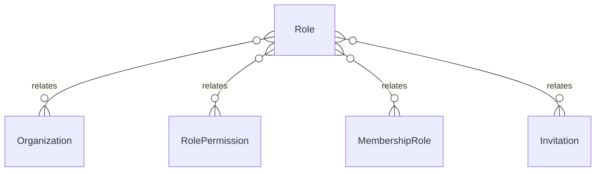

# `Role` → `roles`

<!-- generated by .kb/generate.mjs — do not edit by hand -->

Declared at `packages/db/prisma/schema.prisma:577`.

| property | value |
| --- | --- |
| table | `roles` |
| tenant-scoped | yes — has `organizationId` |
| RLS | exempt — system roles have organization_id NULL by design |
| columns | 9 |
| relations | 4 |

## Columns

| column | type | definition |
| --- | --- | --- |
| `id` | `String` | `id String @id @default(uuid()) @db.Uuid` |
| `organizationId` | `String?` | `organizationId String? @map("organization_id") @db.Uuid` |
| `code` | `String` | `code String @db.VarChar(64)` |
| `name` | `String` | `name String @db.VarChar(128)` |
| `description` | `String?` | `description String? @db.VarChar(512)` |
| `scopeLevel` | `RoleScopeLevel` | `scopeLevel RoleScopeLevel @map("scope_level")` |
| `isSystem` | `Boolean` | `isSystem Boolean @default(false) @map("is_system")` |
| `createdAt` | `DateTime` | `createdAt DateTime @default(now()) @map("created_at") @db.Timestamptz(6)` |
| `updatedAt` | `DateTime` | `updatedAt DateTime @updatedAt @map("updated_at") @db.Timestamptz(6)` |

## Relations

| field | target | definition |
| --- | --- | --- |
| `organization` | [`Organization`](Organization.md) | `organization Organization? @relation(fields: [organizationId], references: [id], onDelete: Cascade)` |
| `permissions` | [`RolePermission`](RolePermission.md) | `permissions RolePermission[]` |
| `assignments` | [`MembershipRole`](MembershipRole.md) | `assignments MembershipRole[]` |
| `invitations` | [`Invitation`](Invitation.md) | `invitations Invitation[]` |

## Indexes and constraints

- `@@unique([organizationId, code])`
- `@@index([isSystem])`

## Neighbourhood

