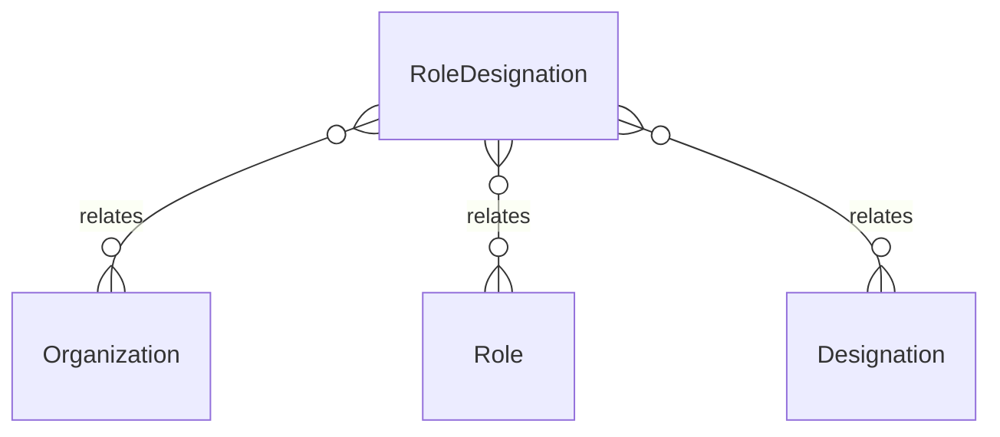

# `RoleDesignation` → `role_designations`

<!-- generated by .kb/generate.mjs — do not edit by hand -->

Declared at `packages/db/prisma/schema/access-control.prisma:272`.

| property | value |
| --- | --- |
| table | `role_designations` |
| tenant-scoped | yes — has `organizationId` |
| RLS | `platform_extensible` policy |
| columns | 6 |
| relations | 3 |

## Columns

| column | type | definition |
| --- | --- | --- |
| `id` | `String` | `id String @id @default(uuid()) @db.Uuid` |
| `organizationId` | `String?` | `organizationId String? @map("organization_id") @db.Uuid` |
| `roleId` | `String` | `roleId String @map("role_id") @db.Uuid` |
| `designationId` | `String` | `designationId String @map("designation_id") @db.Uuid` |
| `isExcluded` | `Boolean` | `isExcluded Boolean @default(false) @map("is_excluded")` |
| `createdAt` | `DateTime` | `createdAt DateTime @default(now()) @map("created_at") @db.Timestamptz(6)` |

## Relations

| field | target | definition |
| --- | --- | --- |
| `organization` | [`Organization`](Organization.md) | `organization Organization? @relation(fields: [organizationId], references: [id], onDelete: Cascade)` |
| `role` | [`Role`](Role.md) | `role Role @relation(fields: [roleId], references: [id], onDelete: Cascade)` |
| `designation` | [`Designation`](Designation.md) | `designation Designation @relation(fields: [designationId], references: [id], onDelete: Cascade)` |

## Indexes and constraints

- `@@unique([organizationId, roleId, designationId])`
- `@@index([roleId])`
- `@@index([designationId])`

## Neighbourhood

