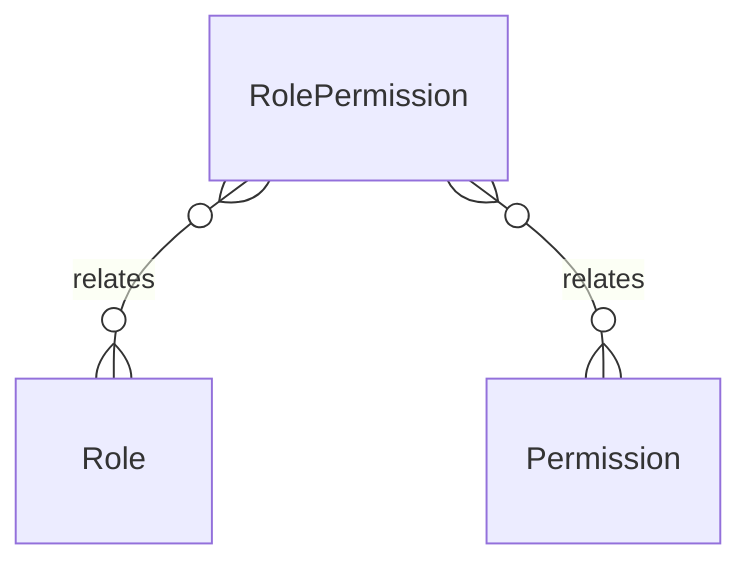

# `RolePermission` → `role_permissions`

<!-- generated by .kb/generate.mjs — do not edit by hand -->

Declared at `packages/db/prisma/schema.prisma:1375`.

| property | value |
| --- | --- |
| table | `role_permissions` |
| tenant-scoped | no |
| RLS | exempt — joins two non-tenant tables |
| columns | 3 |
| relations | 2 |

## Columns

| column | type | definition |
| --- | --- | --- |
| `id` | `String` | `id String @id @default(uuid()) @db.Uuid` |
| `roleId` | `String` | `roleId String @map("role_id") @db.Uuid` |
| `permissionId` | `String` | `permissionId String @map("permission_id") @db.Uuid` |

## Relations

| field | target | definition |
| --- | --- | --- |
| `role` | [`Role`](Role.md) | `role Role @relation(fields: [roleId], references: [id], onDelete: Cascade)` |
| `permission` | [`Permission`](Permission.md) | `permission Permission @relation(fields: [permissionId], references: [id], onDelete: Cascade)` |

## Indexes and constraints

- `@@unique([roleId, permissionId])`

## Neighbourhood

