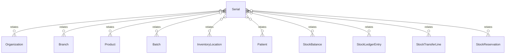

# `Serial` → `serials`

<!-- generated by .kb/generate.mjs — do not edit by hand -->

Declared at `packages/db/prisma/schema/inventory.prisma:460`.

| property | value |
| --- | --- |
| table | `serials` |
| tenant-scoped | yes — has `organizationId` |
| RLS | `branch` policy |
| columns | 14 |
| relations | 10 |

## Columns

| column | type | definition |
| --- | --- | --- |
| `id` | `String` | `id String @id @default(uuid()) @db.Uuid` |
| `organizationId` | `String` | `organizationId String @map("organization_id") @db.Uuid` |
| `branchId` | `String` | `branchId String @map("branch_id") @db.Uuid` |
| `productId` | `String` | `productId String @map("product_id") @db.Uuid` |
| `batchId` | `String?` | `batchId String? @map("batch_id") @db.Uuid` |
| `serialNumber` | `String` | `serialNumber String @map("serial_number") @db.VarChar(128)` |
| `status` | `SerialStatus` | `status SerialStatus @default(IN_STOCK)` |
| `currentLocationId` | `String?` | `currentLocationId String? @map("current_location_id") @db.Uuid` |
| `assignedPatientId` | `String?` | `assignedPatientId String? @map("assigned_patient_id") @db.Uuid` |
| `assignedAt` | `DateTime?` | `assignedAt DateTime? @map("assigned_at") @db.Timestamptz(6)` |
| `expiresOn` | `DateTime?` | `expiresOn DateTime? @db.Date @map("expires_on")` |
| `notes` | `String?` | `notes String? @db.Text` |
| `createdAt` | `DateTime` | `createdAt DateTime @default(now()) @map("created_at") @db.Timestamptz(6)` |
| `updatedAt` | `DateTime` | `updatedAt DateTime @updatedAt @map("updated_at") @db.Timestamptz(6)` |

## Relations

| field | target | definition |
| --- | --- | --- |
| `organization` | [`Organization`](Organization.md) | `organization Organization @relation(fields: [organizationId], references: [id], onDelete: Cascade)` |
| `branch` | [`Branch`](Branch.md) | `branch Branch @relation(fields: [organizationId, branchId], references: [organizationId, id], onDelete: Cascade)` |
| `product` | [`Product`](Product.md) | `product Product @relation(fields: [productId], references: [id], onDelete: Restrict)` |
| `batch` | [`Batch`](Batch.md) | `batch Batch? @relation(fields: [organizationId, branchId, batchId], references: [organizationId, branchId, id], onDelete: Restrict)` |
| `currentLocation` | [`InventoryLocation`](InventoryLocation.md) | `currentLocation InventoryLocation? @relation(fields: [organizationId, branchId, currentLocationId], references: [organizationId, branchId, id], onDelete: Restrict)` |
| `assignedPatient` | [`Patient`](Patient.md) | `assignedPatient Patient? @relation(fields: [organizationId, assignedPatientId], references: [organizationId, id], onDelete: Restrict)` |
| `balances` | [`StockBalance`](StockBalance.md) | `balances StockBalance[]` |
| `movements` | [`StockLedgerEntry`](StockLedgerEntry.md) | `movements StockLedgerEntry[]` |
| `transferLines` | [`StockTransferLine`](StockTransferLine.md) | `transferLines StockTransferLine[] @relation("TransferLineSerial")` |
| `reservations` | [`StockReservation`](StockReservation.md) | `reservations StockReservation[]` |

## Indexes and constraints

- `@@unique([organizationId, productId, serialNumber])`
- `@@unique([organizationId, id])`
- `@@unique([organizationId, branchId, id])`
- `@@index([organizationId, branchId, status])`
- `@@index([organizationId, batchId])`
- `@@index([organizationId, assignedPatientId])`

## Neighbourhood

