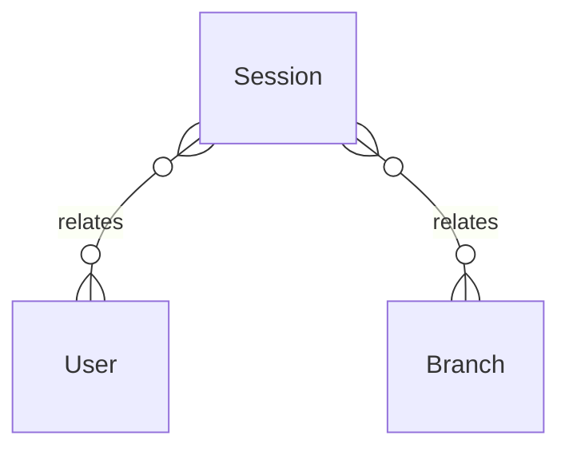

# `Session` → `sessions`

<!-- generated by .kb/generate.mjs — do not edit by hand -->

Declared at `packages/db/prisma/schema/identity.prisma:167`.

| property | value |
| --- | --- |
| table | `sessions` |
| tenant-scoped | no |
| RLS | exempt — looked up by refresh-token hash pre-context |
| columns | 13 |
| relations | 2 |

## Columns

| column | type | definition |
| --- | --- | --- |
| `id` | `String` | `id String @id @default(uuid()) @db.Uuid` |
| `userId` | `String` | `userId String @map("user_id") @db.Uuid` |
| `activeOrganizationId` | `String?` | `activeOrganizationId String? @map("active_organization_id") @db.Uuid` |
| `activeBranchId` | `String?` | `activeBranchId String? @map("active_branch_id") @db.Uuid` |
| `impersonatedByUserId` | `String?` | `impersonatedByUserId String? @map("impersonated_by_user_id") @db.Uuid` |
| `refreshTokenHash` | `String` | `refreshTokenHash String @unique @map("refresh_token_hash") @db.VarChar(255)` |
| `previousTokenHash` | `String?` | `previousTokenHash String? @map("previous_token_hash") @db.VarChar(255)` |
| `ipAddress` | `String?` | `ipAddress String? @map("ip_address") @db.Inet` |
| `userAgent` | `String?` | `userAgent String? @map("user_agent") @db.VarChar(512)` |
| `expiresAt` | `DateTime` | `expiresAt DateTime @map("expires_at") @db.Timestamptz(6)` |
| `revokedAt` | `DateTime?` | `revokedAt DateTime? @map("revoked_at") @db.Timestamptz(6)` |
| `createdAt` | `DateTime` | `createdAt DateTime @default(now()) @map("created_at") @db.Timestamptz(6)` |
| `lastUsedAt` | `DateTime?` | `lastUsedAt DateTime? @map("last_used_at") @db.Timestamptz(6)` |

## Relations

| field | target | definition |
| --- | --- | --- |
| `user` | [`User`](User.md) | `user User @relation(fields: [userId], references: [id], onDelete: Cascade)` |
| `activeBranch` | [`Branch`](Branch.md) | `activeBranch Branch? @relation(fields: [activeBranchId], references: [id], onDelete: SetNull)` |

## Indexes and constraints

- `@@index([userId, revokedAt])`
- `@@index([expiresAt])`

## Neighbourhood

