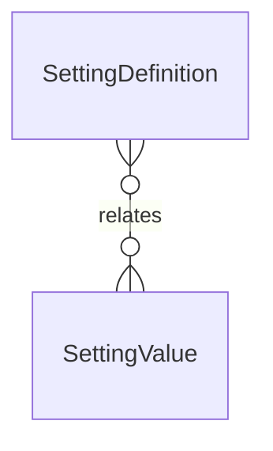

# `SettingDefinition` → `setting_definitions`

<!-- generated by .kb/generate.mjs — do not edit by hand -->

Declared at `packages/db/prisma/schema/settings-files-audit.prisma:38`.

| property | value |
| --- | --- |
| table | `setting_definitions` |
| tenant-scoped | no |
| RLS | exempt — static catalogue |
| columns | 9 |
| relations | 1 |

## Columns

| column | type | definition |
| --- | --- | --- |
| `key` | `String` | `key String @id @db.VarChar(128)` |
| `module` | `String` | `module String @db.VarChar(64)` |
| `dataType` | `SettingDataType` | `dataType SettingDataType @map("data_type")` |
| `defaultValue` | `Json` | `defaultValue Json @map("default_value")` |
| `allowedScopes` | `Json` | `allowedScopes Json @map("allowed_scopes")` |
| `isTenantEditable` | `Boolean` | `isTenantEditable Boolean @default(true) @map("is_tenant_editable")` |
| `description` | `String?` | `description String? @db.VarChar(512)` |
| `helpText` | `String?` | `helpText String? @map("help_text") @db.VarChar(1024)` |
| `allowedValues` | `Json?` | `allowedValues Json? @map("allowed_values")` |

## Relations

| field | target | definition |
| --- | --- | --- |
| `values` | [`SettingValue`](SettingValue.md) | `values SettingValue[]` |

## Indexes and constraints

- `@@index([module])`

## Neighbourhood

