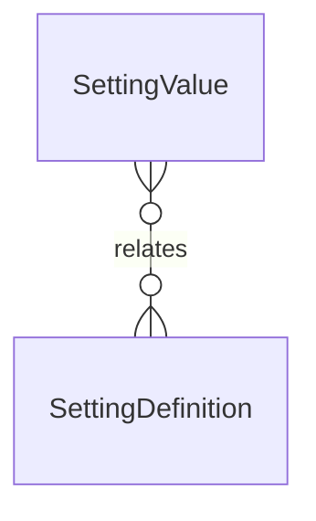

# `SettingValue` → `setting_values`

<!-- generated by .kb/generate.mjs — do not edit by hand -->

Declared at `packages/db/prisma/schema.prisma:1331`.

| property | value |
| --- | --- |
| table | `setting_values` |
| tenant-scoped | no |
| RLS | exempt — scoped by (scope_type, scope_id), not organization_id |
| columns | 7 |
| relations | 1 |

## Columns

| column | type | definition |
| --- | --- | --- |
| `id` | `String` | `id String @id @default(uuid()) @db.Uuid` |
| `settingKey` | `String` | `settingKey String @map("setting_key") @db.VarChar(128)` |
| `scopeType` | `SettingScopeType` | `scopeType SettingScopeType @map("scope_type")` |
| `scopeId` | `String?` | `scopeId String? @map("scope_id") @db.Uuid` |
| `value` | `Json` | `value Json` |
| `updatedBy` | `String?` | `updatedBy String? @map("updated_by") @db.Uuid` |
| `updatedAt` | `DateTime` | `updatedAt DateTime @updatedAt @map("updated_at") @db.Timestamptz(6)` |

## Relations

| field | target | definition |
| --- | --- | --- |
| `definition` | [`SettingDefinition`](SettingDefinition.md) | `definition SettingDefinition @relation(fields: [settingKey], references: [key], onDelete: Cascade)` |

## Indexes and constraints

- `@@unique([settingKey, scopeType, scopeId])`
- `@@index([scopeType, scopeId])`

## Neighbourhood

