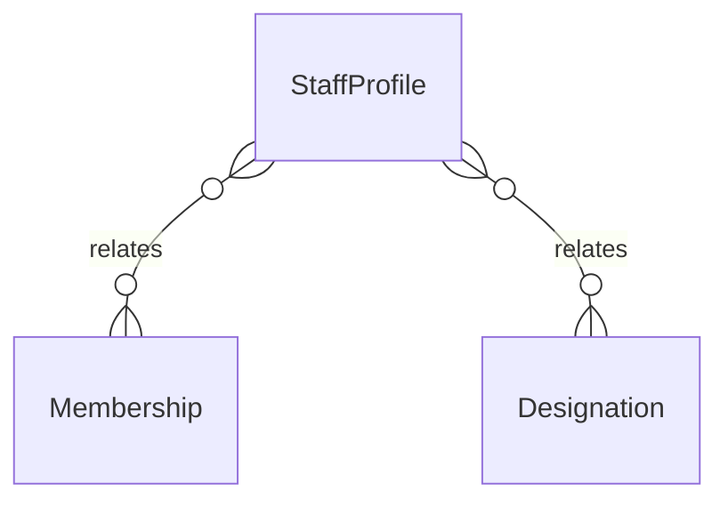

# `StaffProfile` → `staff_profiles`

<!-- generated by .kb/generate.mjs — do not edit by hand -->

Declared at `packages/db/prisma/schema.prisma:2040`.

| property | value |
| --- | --- |
| table | `staff_profiles` |
| tenant-scoped | no |
| RLS | `parent` policy |
| columns | 7 |
| relations | 2 |

## Columns

| column | type | definition |
| --- | --- | --- |
| `id` | `String` | `id String @id @default(uuid()) @db.Uuid` |
| `membershipId` | `String` | `membershipId String @unique @map("membership_id") @db.Uuid` |
| `employeeCode` | `String?` | `employeeCode String? @map("employee_code") @db.VarChar(64)` |
| `department` | `String?` | `department String? @db.VarChar(128)` |
| `designationId` | `String?` | `designationId String? @map("designation_id") @db.Uuid` |
| `joinedOn` | `DateTime?` | `joinedOn DateTime? @map("joined_on") @db.Date` |
| `relievedOn` | `DateTime?` | `relievedOn DateTime? @map("relieved_on") @db.Date` |

## Relations

| field | target | definition |
| --- | --- | --- |
| `membership` | [`Membership`](Membership.md) | `membership Membership @relation(fields: [membershipId], references: [id], onDelete: Cascade)` |
| `designation` | [`Designation`](Designation.md) | `designation Designation? @relation(fields: [designationId], references: [id], onDelete: SetNull)` |

## Indexes and constraints

- `@@index([designationId])`

## Neighbourhood

