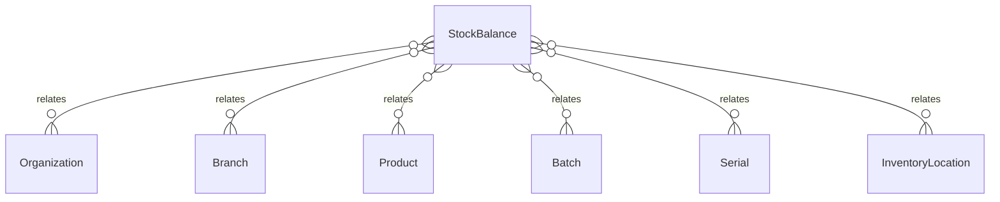

# `StockBalance` → `stock_balances`

<!-- generated by .kb/generate.mjs — do not edit by hand -->

Declared at `packages/db/prisma/schema/inventory.prisma:703`.

| property | value |
| --- | --- |
| table | `stock_balances` |
| tenant-scoped | yes — has `organizationId` |
| RLS | `visible` policy |
| columns | 10 |
| relations | 6 |

## Columns

| column | type | definition |
| --- | --- | --- |
| `id` | `String` | `id String @id @default(uuid()) @db.Uuid` |
| `organizationId` | `String` | `organizationId String @map("organization_id") @db.Uuid` |
| `branchId` | `String` | `branchId String @map("branch_id") @db.Uuid` |
| `productId` | `String` | `productId String @map("product_id") @db.Uuid` |
| `batchId` | `String?` | `batchId String? @map("batch_id") @db.Uuid` |
| `serialId` | `String?` | `serialId String? @map("serial_id") @db.Uuid` |
| `locationId` | `String` | `locationId String @map("location_id") @db.Uuid` |
| `status` | `StockStatus` | `status StockStatus` |
| `quantity` | `Decimal` | `quantity Decimal @db.Decimal(18, 6)` |
| `updatedAt` | `DateTime` | `updatedAt DateTime @updatedAt @map("updated_at") @db.Timestamptz(6)` |

## Relations

| field | target | definition |
| --- | --- | --- |
| `organization` | [`Organization`](Organization.md) | `organization Organization @relation(fields: [organizationId], references: [id], onDelete: Cascade)` |
| `branch` | [`Branch`](Branch.md) | `branch Branch @relation(fields: [organizationId, branchId], references: [organizationId, id], onDelete: Cascade)` |
| `product` | [`Product`](Product.md) | `product Product @relation(fields: [productId], references: [id], onDelete: Restrict)` |
| `batch` | [`Batch`](Batch.md) | `batch Batch? @relation(fields: [organizationId, branchId, batchId], references: [organizationId, branchId, id], onDelete: Restrict)` |
| `serial` | [`Serial`](Serial.md) | `serial Serial? @relation(fields: [organizationId, branchId, serialId], references: [organizationId, branchId, id], onDelete: Restrict)` |
| `location` | [`InventoryLocation`](InventoryLocation.md) | `location InventoryLocation @relation(fields: [organizationId, branchId, locationId], references: [organizationId, branchId, id], onDelete: Restrict)` |

## Indexes and constraints

- `@@unique([organizationId, branchId, productId, batchId, serialId, locationId, status])`
- `@@index([organizationId, branchId, locationId, productId, status])`
- `@@index([organizationId, productId, status])`
- `@@index([organizationId, batchId])`

## Neighbourhood

