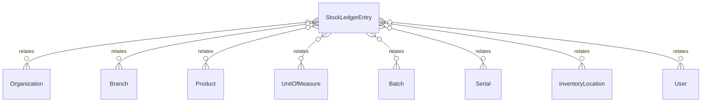

# `StockLedgerEntry` → `stock_ledger`

<!-- generated by .kb/generate.mjs — do not edit by hand -->

Declared at `packages/db/prisma/schema/inventory.prisma:614`.

| property | value |
| --- | --- |
| table | `stock_ledger` |
| tenant-scoped | yes — has `organizationId` |
| RLS | `visible` policy |
| columns | 24 |
| relations | 9 |

## Columns

| column | type | definition |
| --- | --- | --- |
| `id` | `String` | `id String @id @default(uuid()) @db.Uuid` |
| `organizationId` | `String` | `organizationId String @map("organization_id") @db.Uuid` |
| `branchId` | `String` | `branchId String @map("branch_id") @db.Uuid` |
| `productId` | `String` | `productId String @map("product_id") @db.Uuid` |
| `batchId` | `String?` | `batchId String? @map("batch_id") @db.Uuid` |
| `serialId` | `String?` | `serialId String? @map("serial_id") @db.Uuid` |
| `trackingMode` | `TrackingMode` | `trackingMode TrackingMode @map("tracking_mode")` |
| `movementType` | `StockMovementType` | `movementType StockMovementType @map("movement_type")` |
| `quantityBase` | `Decimal` | `quantityBase Decimal @map("quantity_base") @db.Decimal(18, 6)` |
| `quantityEntered` | `Decimal` | `quantityEntered Decimal @map("quantity_entered") @db.Decimal(18, 6)` |
| `unitId` | `String` | `unitId String @map("unit_id") @db.Uuid` |
| `fromLocationId` | `String?` | `fromLocationId String? @map("from_location_id") @db.Uuid` |
| `toLocationId` | `String?` | `toLocationId String? @map("to_location_id") @db.Uuid` |
| `statusFrom` | `StockStatus?` | `statusFrom StockStatus? @map("status_from")` |
| `statusTo` | `StockStatus?` | `statusTo StockStatus? @map("status_to")` |
| `reasonCode` | `String?` | `reasonCode String? @map("reason_code") @db.VarChar(64)` |
| `reasonNote` | `String?` | `reasonNote String? @map("reason_note") @db.Text` |
| `referenceType` | `StockReferenceType` | `referenceType StockReferenceType @map("reference_type")` |
| `referenceId` | `String?` | `referenceId String? @map("reference_id") @db.Uuid` |
| `unitCostBase` | `BigInt?` | `unitCostBase BigInt? @map("unit_cost_base") @db.BigInt` |
| `currency` | `String?` | `currency String? @db.Char(3)` |
| `actorUserId` | `String` | `actorUserId String @map("actor_user_id") @db.Uuid` |
| `occurredAt` | `DateTime` | `occurredAt DateTime @default(now()) @map("occurred_at") @db.Timestamptz(6)` |
| `recordedAt` | `DateTime` | `recordedAt DateTime @default(now()) @map("recorded_at") @db.Timestamptz(6)` |

## Relations

| field | target | definition |
| --- | --- | --- |
| `organization` | [`Organization`](Organization.md) | `organization Organization @relation(fields: [organizationId], references: [id], onDelete: Cascade)` |
| `branch` | [`Branch`](Branch.md) | `branch Branch @relation(fields: [organizationId, branchId], references: [organizationId, id], onDelete: Cascade)` |
| `product` | [`Product`](Product.md) | `product Product @relation(fields: [productId], references: [id], onDelete: Restrict)` |
| `unit` | [`UnitOfMeasure`](UnitOfMeasure.md) | `unit UnitOfMeasure @relation(fields: [unitId], references: [id], onDelete: Restrict)` |
| `batch` | [`Batch`](Batch.md) | `batch Batch? @relation(fields: [organizationId, branchId, batchId], references: [organizationId, branchId, id], onDelete: Restrict)` |
| `serial` | [`Serial`](Serial.md) | `serial Serial? @relation(fields: [organizationId, branchId, serialId], references: [organizationId, branchId, id], onDelete: Restrict)` |
| `fromLocation` | [`InventoryLocation`](InventoryLocation.md) | `fromLocation InventoryLocation? @relation("MovementFromLocation", fields: [organizationId, branchId, fromLocationId], references: [organizationId, branchId, id], onDelete: Restrict)` |
| `toLocation` | [`InventoryLocation`](InventoryLocation.md) | `toLocation InventoryLocation? @relation("MovementToLocation", fields: [organizationId, branchId, toLocationId], references: [organizationId, branchId, id], onDelete: Restrict)` |
| `actor` | [`User`](User.md) | `actor User @relation(fields: [actorUserId], references: [id], onDelete: Restrict)` |

## Indexes and constraints

- `@@index([organizationId, branchId, productId, occurredAt(sort: Desc)])`
- `@@index([organizationId, batchId, occurredAt])`
- `@@index([organizationId, referenceType, referenceId])`
- `@@index([organizationId, serialId])`
- `@@index([organizationId, branchId, occurredAt(sort: Desc)])`

## Neighbourhood

