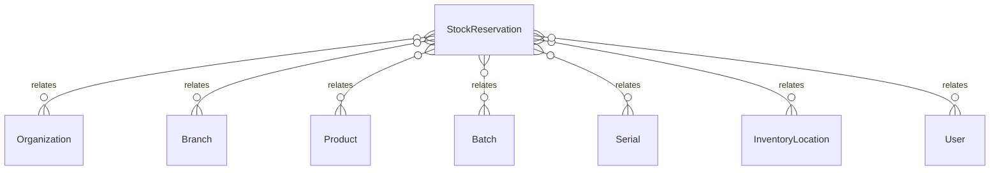

# `StockReservation` → `stock_reservations`

<!-- generated by .kb/generate.mjs — do not edit by hand -->

Declared at `packages/db/prisma/schema/inventory.prisma:1172`.

| property | value |
| --- | --- |
| table | `stock_reservations` |
| tenant-scoped | yes — has `organizationId` |
| RLS | `branch` policy |
| columns | 18 |
| relations | 8 |

## Columns

| column | type | definition |
| --- | --- | --- |
| `id` | `String` | `id String @id @default(uuid()) @db.Uuid` |
| `organizationId` | `String` | `organizationId String @map("organization_id") @db.Uuid` |
| `branchId` | `String` | `branchId String @map("branch_id") @db.Uuid` |
| `productId` | `String` | `productId String @map("product_id") @db.Uuid` |
| `batchId` | `String?` | `batchId String? @map("batch_id") @db.Uuid` |
| `serialId` | `String?` | `serialId String? @map("serial_id") @db.Uuid` |
| `locationId` | `String` | `locationId String @map("location_id") @db.Uuid` |
| `quantityBase` | `Decimal` | `quantityBase Decimal @map("quantity_base") @db.Decimal(18, 6)` |
| `status` | `StockReservationStatus` | `status StockReservationStatus @default(ACTIVE)` |
| `referenceType` | `StockReferenceType` | `referenceType StockReferenceType @default(MANUAL) @map("reference_type")` |
| `referenceId` | `String?` | `referenceId String? @map("reference_id") @db.Uuid` |
| `expiresAt` | `DateTime` | `expiresAt DateTime @map("expires_at") @db.Timestamptz(6)` |
| `notes` | `String?` | `notes String? @db.Text` |
| `createdById` | `String` | `createdById String @map("created_by_id") @db.Uuid` |
| `releasedAt` | `DateTime?` | `releasedAt DateTime? @map("released_at") @db.Timestamptz(6)` |
| `releasedById` | `String?` | `releasedById String? @map("released_by_id") @db.Uuid` |
| `createdAt` | `DateTime` | `createdAt DateTime @default(now()) @map("created_at") @db.Timestamptz(6)` |
| `updatedAt` | `DateTime` | `updatedAt DateTime @updatedAt @map("updated_at") @db.Timestamptz(6)` |

## Relations

| field | target | definition |
| --- | --- | --- |
| `organization` | [`Organization`](Organization.md) | `organization Organization @relation(fields: [organizationId], references: [id], onDelete: Cascade)` |
| `branch` | [`Branch`](Branch.md) | `branch Branch @relation(fields: [organizationId, branchId], references: [organizationId, id], onDelete: Cascade)` |
| `product` | [`Product`](Product.md) | `product Product @relation(fields: [productId], references: [id], onDelete: Restrict)` |
| `batch` | [`Batch`](Batch.md) | `batch Batch? @relation(fields: [organizationId, branchId, batchId], references: [organizationId, branchId, id], onDelete: Restrict)` |
| `serial` | [`Serial`](Serial.md) | `serial Serial? @relation(fields: [organizationId, branchId, serialId], references: [organizationId, branchId, id], onDelete: Restrict)` |
| `location` | [`InventoryLocation`](InventoryLocation.md) | `location InventoryLocation @relation(fields: [organizationId, branchId, locationId], references: [organizationId, branchId, id], onDelete: Restrict)` |
| `createdBy` | [`User`](User.md) | `createdBy User @relation("ReservationCreatedBy", fields: [createdById], references: [id], onDelete: Restrict)` |
| `releasedBy` | [`User`](User.md) | `releasedBy User? @relation("ReservationReleasedBy", fields: [releasedById], references: [id], onDelete: Restrict)` |

## Indexes and constraints

- `@@index([organizationId, status, expiresAt])`
- `@@index([organizationId, branchId, productId, status])`
- `@@index([organizationId, referenceType, referenceId])`

## Neighbourhood

