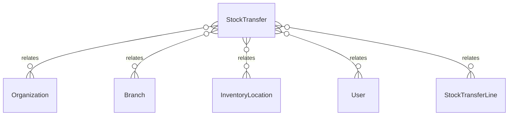

# `StockTransfer` → `stock_transfers`

<!-- generated by .kb/generate.mjs — do not edit by hand -->

Declared at `packages/db/prisma/schema/inventory.prisma:924`.

| property | value |
| --- | --- |
| table | `stock_transfers` |
| tenant-scoped | yes — has `organizationId` |
| RLS | `org` policy |
| columns | 21 |
| relations | 10 |

## Columns

| column | type | definition |
| --- | --- | --- |
| `id` | `String` | `id String @id @default(uuid()) @db.Uuid` |
| `organizationId` | `String` | `organizationId String @map("organization_id") @db.Uuid` |
| `transferNumber` | `String?` | `transferNumber String? @map("transfer_number") @db.VarChar(64)` |
| `fromBranchId` | `String` | `fromBranchId String @map("from_branch_id") @db.Uuid` |
| `toBranchId` | `String` | `toBranchId String @map("to_branch_id") @db.Uuid` |
| `fromLocationId` | `String` | `fromLocationId String @map("from_location_id") @db.Uuid` |
| `toLocationId` | `String?` | `toLocationId String? @map("to_location_id") @db.Uuid` |
| `fromLocationName` | `String` | `fromLocationName String @map("from_location_name") @db.VarChar(255)` |
| `toLocationName` | `String?` | `toLocationName String? @map("to_location_name") @db.VarChar(255)` |
| `status` | `StockTransferStatus` | `status StockTransferStatus @default(DRAFT)` |
| `notes` | `String?` | `notes String? @db.Text` |
| `createdById` | `String` | `createdById String @map("created_by_id") @db.Uuid` |
| `dispatchedAt` | `DateTime?` | `dispatchedAt DateTime? @map("dispatched_at") @db.Timestamptz(6)` |
| `dispatchedById` | `String?` | `dispatchedById String? @map("dispatched_by_id") @db.Uuid` |
| `receivedAt` | `DateTime?` | `receivedAt DateTime? @map("received_at") @db.Timestamptz(6)` |
| `receivedById` | `String?` | `receivedById String? @map("received_by_id") @db.Uuid` |
| `cancelledAt` | `DateTime?` | `cancelledAt DateTime? @map("cancelled_at") @db.Timestamptz(6)` |
| `cancelledById` | `String?` | `cancelledById String? @map("cancelled_by_id") @db.Uuid` |
| `cancellationReason` | `String?` | `cancellationReason String? @map("cancellation_reason") @db.Text` |
| `createdAt` | `DateTime` | `createdAt DateTime @default(now()) @map("created_at") @db.Timestamptz(6)` |
| `updatedAt` | `DateTime` | `updatedAt DateTime @updatedAt @map("updated_at") @db.Timestamptz(6)` |

## Relations

| field | target | definition |
| --- | --- | --- |
| `organization` | [`Organization`](Organization.md) | `organization Organization @relation(fields: [organizationId], references: [id], onDelete: Cascade)` |
| `fromBranch` | [`Branch`](Branch.md) | `fromBranch Branch @relation("TransferFromBranch", fields: [organizationId, fromBranchId], references: [organizationId, id], onDelete: Cascade)` |
| `toBranch` | [`Branch`](Branch.md) | `toBranch Branch @relation("TransferToBranch", fields: [organizationId, toBranchId], references: [organizationId, id], onDelete: Cascade)` |
| `fromLocation` | [`InventoryLocation`](InventoryLocation.md) | `fromLocation InventoryLocation @relation("TransferFromLocation", fields: [organizationId, fromBranchId, fromLocationId], references: [organizationId, branchId, id], onDelete: Restrict)` |
| `toLocation` | [`InventoryLocation`](InventoryLocation.md) | `toLocation InventoryLocation? @relation("TransferToLocation", fields: [organizationId, toBranchId, toLocationId], references: [organizationId, branchId, id], onDelete: Restrict)` |
| `createdBy` | [`User`](User.md) | `createdBy User @relation("TransferCreatedBy", fields: [createdById], references: [id], onDelete: Restrict)` |
| `dispatchedBy` | [`User`](User.md) | `dispatchedBy User? @relation("TransferDispatchedBy", fields: [dispatchedById], references: [id], onDelete: Restrict)` |
| `receivedBy` | [`User`](User.md) | `receivedBy User? @relation("TransferReceivedBy", fields: [receivedById], references: [id], onDelete: Restrict)` |
| `cancelledBy` | [`User`](User.md) | `cancelledBy User? @relation("TransferCancelledBy", fields: [cancelledById], references: [id], onDelete: Restrict)` |
| `lines` | [`StockTransferLine`](StockTransferLine.md) | `lines StockTransferLine[]` |

## Indexes and constraints

- `@@unique([organizationId, transferNumber])`
- `@@unique([organizationId, id])`
- `@@index([organizationId, toBranchId, status])`
- `@@index([organizationId, fromBranchId, status, createdAt(sort: Desc)])`

## Neighbourhood

