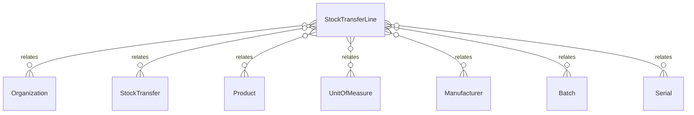

# `StockTransferLine` → `stock_transfer_lines`

<!-- generated by .kb/generate.mjs — do not edit by hand -->

Declared at `packages/db/prisma/schema/inventory.prisma:1015`.

| property | value |
| --- | --- |
| table | `stock_transfer_lines` |
| tenant-scoped | yes — has `organizationId` |
| RLS | `visible` policy |
| columns | 20 |
| relations | 8 |

## Columns

| column | type | definition |
| --- | --- | --- |
| `id` | `String` | `id String @id @default(uuid()) @db.Uuid` |
| `organizationId` | `String` | `organizationId String @map("organization_id") @db.Uuid` |
| `transferId` | `String` | `transferId String @map("transfer_id") @db.Uuid` |
| `productId` | `String` | `productId String @map("product_id") @db.Uuid` |
| `batchId` | `String?` | `batchId String? @map("batch_id") @db.Uuid` |
| `serialId` | `String?` | `serialId String? @map("serial_id") @db.Uuid` |
| `sentQuantityBase` | `Decimal` | `sentQuantityBase Decimal @map("sent_quantity_base") @db.Decimal(18, 6)` |
| `receivedQuantityBase` | `Decimal` | `receivedQuantityBase Decimal @default(0) @map("received_quantity_base") @db.Decimal(18, 6)` |
| `quantityEntered` | `Decimal` | `quantityEntered Decimal @map("quantity_entered") @db.Decimal(18, 6)` |
| `unitId` | `String` | `unitId String @map("unit_id") @db.Uuid` |
| `destinationBatchId` | `String?` | `destinationBatchId String? @map("destination_batch_id") @db.Uuid` |
| `lotNumber` | `String?` | `lotNumber String? @map("lot_number") @db.VarChar(128)` |
| `manufacturedOn` | `DateTime?` | `manufacturedOn DateTime? @map("manufactured_on") @db.Date` |
| `expiresOn` | `DateTime?` | `expiresOn DateTime? @map("expires_on") @db.Date` |
| `manufacturerId` | `String?` | `manufacturerId String? @map("manufacturer_id") @db.Uuid` |
| `unitCostBase` | `BigInt?` | `unitCostBase BigInt? @map("unit_cost_base") @db.BigInt` |
| `currency` | `String?` | `currency String? @db.Char(3)` |
| `notes` | `String?` | `notes String? @db.Text` |
| `createdAt` | `DateTime` | `createdAt DateTime @default(now()) @map("created_at") @db.Timestamptz(6)` |
| `updatedAt` | `DateTime` | `updatedAt DateTime @updatedAt @map("updated_at") @db.Timestamptz(6)` |

## Relations

| field | target | definition |
| --- | --- | --- |
| `organization` | [`Organization`](Organization.md) | `organization Organization @relation(fields: [organizationId], references: [id], onDelete: Cascade)` |
| `transfer` | [`StockTransfer`](StockTransfer.md) | `transfer StockTransfer @relation(fields: [organizationId, transferId], references: [organizationId, id], onDelete: Cascade)` |
| `product` | [`Product`](Product.md) | `product Product @relation(fields: [productId], references: [id], onDelete: Restrict)` |
| `unit` | [`UnitOfMeasure`](UnitOfMeasure.md) | `unit UnitOfMeasure @relation("TransferLineUnit", fields: [unitId], references: [id], onDelete: Restrict)` |
| `manufacturer` | [`Manufacturer`](Manufacturer.md) | `manufacturer Manufacturer? @relation("TransferLineManufacturer", fields: [manufacturerId], references: [id], onDelete: Restrict)` |
| `batch` | [`Batch`](Batch.md) | `batch Batch? @relation("TransferLineSourceBatch", fields: [organizationId, batchId], references: [organizationId, id], onDelete: Restrict)` |
| `destinationBatch` | [`Batch`](Batch.md) | `destinationBatch Batch? @relation("TransferLineDestinationBatch", fields: [organizationId, destinationBatchId], references: [organizationId, id], onDelete: Restrict)` |
| `serial` | [`Serial`](Serial.md) | `serial Serial? @relation("TransferLineSerial", fields: [organizationId, serialId], references: [organizationId, id], onDelete: Restrict)` |

## Indexes and constraints

- `@@unique([organizationId, transferId, productId, batchId, serialId])`
- `@@index([organizationId, transferId])`
- `@@index([organizationId, productId])`
- `@@index([organizationId, batchId])`

## Neighbourhood

