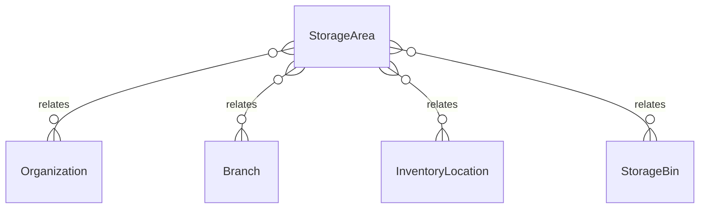

# `StorageArea` → `storage_areas`

<!-- generated by .kb/generate.mjs — do not edit by hand -->

Declared at `packages/db/prisma/schema/inventory.prisma:320`.

| property | value |
| --- | --- |
| table | `storage_areas` |
| tenant-scoped | yes — has `organizationId` |
| RLS | `org` policy |
| columns | 9 |
| relations | 4 |

## Columns

| column | type | definition |
| --- | --- | --- |
| `id` | `String` | `id String @id @default(uuid()) @db.Uuid` |
| `organizationId` | `String` | `organizationId String @map("organization_id") @db.Uuid` |
| `branchId` | `String` | `branchId String @map("branch_id") @db.Uuid` |
| `locationId` | `String` | `locationId String @map("location_id") @db.Uuid` |
| `code` | `String` | `code String @db.VarChar(64)` |
| `name` | `String` | `name String @db.VarChar(255)` |
| `isActive` | `Boolean` | `isActive Boolean @default(true) @map("is_active")` |
| `createdAt` | `DateTime` | `createdAt DateTime @default(now()) @map("created_at") @db.Timestamptz(6)` |
| `updatedAt` | `DateTime` | `updatedAt DateTime @updatedAt @map("updated_at") @db.Timestamptz(6)` |

## Relations

| field | target | definition |
| --- | --- | --- |
| `organization` | [`Organization`](Organization.md) | `organization Organization @relation(fields: [organizationId], references: [id], onDelete: Cascade)` |
| `branch` | [`Branch`](Branch.md) | `branch Branch @relation(fields: [organizationId, branchId], references: [organizationId, id], onDelete: Cascade)` |
| `location` | [`InventoryLocation`](InventoryLocation.md) | `location InventoryLocation @relation(fields: [organizationId, branchId, locationId], references: [organizationId, branchId, id], onDelete: Cascade)` |
| `bins` | [`StorageBin`](StorageBin.md) | `bins StorageBin[]` |

## Indexes and constraints

- `@@unique([organizationId, locationId, code])`
- `@@unique([organizationId, id])`
- `@@index([organizationId, branchId, locationId])`

## Neighbourhood

