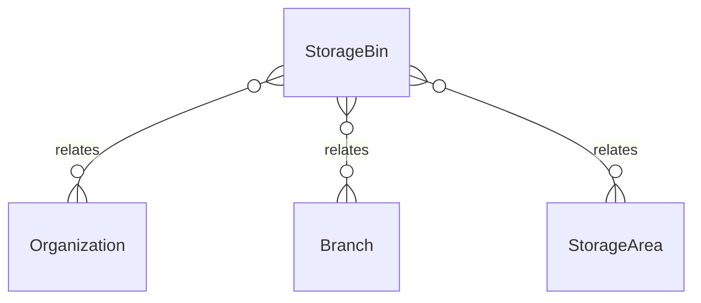

# `StorageBin` → `storage_bins`

<!-- generated by .kb/generate.mjs — do not edit by hand -->

Declared at `packages/db/prisma/schema/inventory.prisma:348`.

| property | value |
| --- | --- |
| table | `storage_bins` |
| tenant-scoped | yes — has `organizationId` |
| RLS | `org` policy |
| columns | 9 |
| relations | 3 |

## Columns

| column | type | definition |
| --- | --- | --- |
| `id` | `String` | `id String @id @default(uuid()) @db.Uuid` |
| `organizationId` | `String` | `organizationId String @map("organization_id") @db.Uuid` |
| `branchId` | `String` | `branchId String @map("branch_id") @db.Uuid` |
| `areaId` | `String` | `areaId String @map("area_id") @db.Uuid` |
| `code` | `String` | `code String @db.VarChar(64)` |
| `label` | `String?` | `label String? @db.VarChar(255)` |
| `isActive` | `Boolean` | `isActive Boolean @default(true) @map("is_active")` |
| `createdAt` | `DateTime` | `createdAt DateTime @default(now()) @map("created_at") @db.Timestamptz(6)` |
| `updatedAt` | `DateTime` | `updatedAt DateTime @updatedAt @map("updated_at") @db.Timestamptz(6)` |

## Relations

| field | target | definition |
| --- | --- | --- |
| `organization` | [`Organization`](Organization.md) | `organization Organization @relation(fields: [organizationId], references: [id], onDelete: Cascade)` |
| `branch` | [`Branch`](Branch.md) | `branch Branch @relation(fields: [organizationId, branchId], references: [organizationId, id], onDelete: Cascade)` |
| `area` | [`StorageArea`](StorageArea.md) | `area StorageArea @relation(fields: [organizationId, areaId], references: [organizationId, id], onDelete: Cascade)` |

## Indexes and constraints

- `@@unique([organizationId, areaId, code])`
- `@@unique([organizationId, id])`
- `@@index([organizationId, branchId, areaId])`

## Neighbourhood

