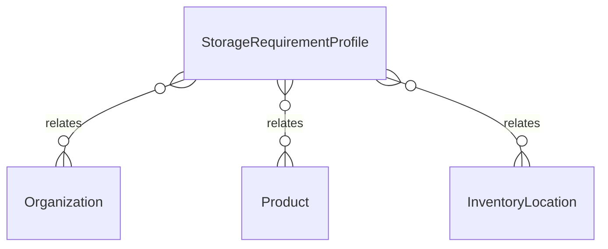

# `StorageRequirementProfile` → `storage_requirement_profiles`

<!-- generated by .kb/generate.mjs — do not edit by hand -->

Declared at `packages/db/prisma/schema/products.prisma:568`.

| property | value |
| --- | --- |
| table | `storage_requirement_profiles` |
| tenant-scoped | yes — has `organizationId` |
| RLS | **MISSING — this is a tenant-isolation defect** |
| columns | 15 |
| relations | 3 |

## Columns

| column | type | definition |
| --- | --- | --- |
| `id` | `String` | `id String @id @default(uuid()) @db.Uuid` |
| `organizationId` | `String?` | `organizationId String? @map("organization_id") @db.Uuid` |
| `code` | `String` | `code String @db.VarChar(64)` |
| `name` | `String` | `name String @db.VarChar(255)` |
| `minTemperatureC` | `Decimal?` | `minTemperatureC Decimal? @map("min_temperature_c") @db.Decimal(5, 2)` |
| `maxTemperatureC` | `Decimal?` | `maxTemperatureC Decimal? @map("max_temperature_c") @db.Decimal(5, 2)` |
| `minHumidityPct` | `Int?` | `minHumidityPct Int? @map("min_humidity_pct")` |
| `maxHumidityPct` | `Int?` | `maxHumidityPct Int? @map("max_humidity_pct")` |
| `lightSensitivity` | `LightSensitivity` | `lightSensitivity LightSensitivity @default(NONE) @map("light_sensitivity")` |
| `requiresControlledAccess` | `Boolean` | `requiresControlledAccess Boolean @default(false) @map("requires_controlled_access")` |
| `hazardClass` | `String?` | `hazardClass String? @map("hazard_class") @db.VarChar(64)` |
| `handlingNotes` | `String?` | `handlingNotes String? @map("handling_notes") @db.Text` |
| `isActive` | `Boolean` | `isActive Boolean @default(true) @map("is_active")` |
| `createdAt` | `DateTime` | `createdAt DateTime @default(now()) @map("created_at") @db.Timestamptz(6)` |
| `updatedAt` | `DateTime` | `updatedAt DateTime @updatedAt @map("updated_at") @db.Timestamptz(6)` |

## Relations

| field | target | definition |
| --- | --- | --- |
| `organization` | [`Organization`](Organization.md) | `organization Organization? @relation(fields: [organizationId], references: [id], onDelete: Cascade)` |
| `products` | [`Product`](Product.md) | `products Product[]` |
| `locations` | [`InventoryLocation`](InventoryLocation.md) | `locations InventoryLocation[]` |

## Indexes and constraints

- `@@unique([organizationId, code])`
- `@@unique([organizationId, id])`
- `@@index([organizationId, isActive])`

## Neighbourhood

