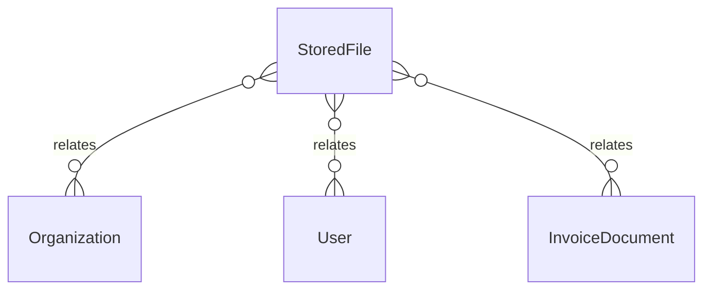

# `StoredFile` → `files`

<!-- generated by .kb/generate.mjs — do not edit by hand -->

Declared at `packages/db/prisma/schema/settings-files-audit.prisma:144`.

| property | value |
| --- | --- |
| table | `files` |
| tenant-scoped | yes — has `organizationId` |
| RLS | `explicit` policy |
| columns | 16 |
| relations | 3 |

## Columns

| column | type | definition |
| --- | --- | --- |
| `id` | `String` | `id String @id @default(uuid()) @db.Uuid` |
| `organizationId` | `String?` | `organizationId String? @map("organization_id") @db.Uuid` |
| `branchId` | `String?` | `branchId String? @map("branch_id") @db.Uuid` |
| `documentType` | `DocumentType` | `documentType DocumentType @default(UPLOAD) @map("document_type")` |
| `status` | `DocumentStatus` | `status DocumentStatus @default(READY)` |
| `storageProvider` | `String` | `storageProvider String @default("local") @map("storage_provider") @db.VarChar(16)` |
| `storageKey` | `String` | `storageKey String @unique @map("storage_key") @db.VarChar(512)` |
| `originalName` | `String` | `originalName String @map("original_name") @db.VarChar(255)` |
| `mimeType` | `String` | `mimeType String @map("mime_type") @db.VarChar(128)` |
| `sizeBytes` | `BigInt` | `sizeBytes BigInt @default(0) @map("size_bytes")` |
| `checksum` | `String?` | `checksum String? @db.VarChar(128)` |
| `version` | `Int` | `version Int @default(1) @db.SmallInt` |
| `failureReason` | `String?` | `failureReason String? @map("failure_reason") @db.VarChar(500)` |
| `uploadedBy` | `String?` | `uploadedBy String? @map("uploaded_by") @db.Uuid` |
| `uploadedAt` | `DateTime` | `uploadedAt DateTime @default(now()) @map("uploaded_at") @db.Timestamptz(6)` |
| `deletedAt` | `DateTime?` | `deletedAt DateTime? @map("deleted_at") @db.Timestamptz(6)` |

## Relations

| field | target | definition |
| --- | --- | --- |
| `organization` | [`Organization`](Organization.md) | `organization Organization? @relation(fields: [organizationId], references: [id], onDelete: Cascade)` |
| `uploader` | [`User`](User.md) | `uploader User? @relation(fields: [uploadedBy], references: [id], onDelete: SetNull)` |
| `invoiceDocuments` | [`InvoiceDocument`](InvoiceDocument.md) | `invoiceDocuments InvoiceDocument[]` |

## Indexes and constraints

- `@@unique([organizationId, id])`
- `@@index([organizationId, branchId])`
- `@@index([organizationId, documentType, status])`

## Neighbourhood

