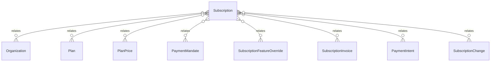

# `Subscription` → `subscriptions`

<!-- generated by .kb/generate.mjs — do not edit by hand -->

Declared at `packages/db/prisma/schema.prisma:1206`.

| property | value |
| --- | --- |
| table | `subscriptions` |
| tenant-scoped | yes — has `organizationId` |
| RLS | `org` policy |
| columns | 24 |
| relations | 8 |

## Columns

| column | type | definition |
| --- | --- | --- |
| `id` | `String` | `id String @id @default(uuid()) @db.Uuid` |
| `organizationId` | `String` | `organizationId String @map("organization_id") @db.Uuid` |
| `planId` | `String` | `planId String @map("plan_id") @db.Uuid` |
| `planPriceId` | `String` | `planPriceId String @map("plan_price_id") @db.Uuid` |
| `status` | `SubscriptionStatus` | `status SubscriptionStatus @default(TRIALING)` |
| `currency` | `String` | `currency String @default("INR") @db.Char(3)` |
| `trialEndsAt` | `DateTime?` | `trialEndsAt DateTime? @map("trial_ends_at") @db.Timestamptz(6)` |
| `currentPeriodStart` | `DateTime` | `currentPeriodStart DateTime @map("current_period_start") @db.Timestamptz(6)` |
| `currentPeriodEnd` | `DateTime` | `currentPeriodEnd DateTime @map("current_period_end") @db.Timestamptz(6)` |
| `cancelAt` | `DateTime?` | `cancelAt DateTime? @map("cancel_at") @db.Timestamptz(6)` |
| `canceledAt` | `DateTime?` | `canceledAt DateTime? @map("canceled_at") @db.Timestamptz(6)` |
| `cancelAtPeriodEnd` | `Boolean` | `cancelAtPeriodEnd Boolean @default(false) @map("cancel_at_period_end")` |
| `cancelReason` | `String?` | `cancelReason String? @map("cancel_reason") @db.VarChar(500)` |
| `autoRenew` | `Boolean` | `autoRenew Boolean @default(false) @map("auto_renew")` |
| `seatQuantity` | `Int` | `seatQuantity Int @default(1) @map("seat_quantity")` |
| `provider` | `String?` | `provider String? @db.VarChar(32)` |
| `mandateId` | `String?` | `mandateId String? @map("mandate_id") @db.Uuid` |
| `gracePeriodEnd` | `DateTime?` | `gracePeriodEnd DateTime? @map("grace_period_end") @db.Timestamptz(6)` |
| `dunningAttempts` | `Int` | `dunningAttempts Int @default(0) @map("dunning_attempts") @db.SmallInt` |
| `lastRenewalAt` | `DateTime?` | `lastRenewalAt DateTime? @map("last_renewal_attempt_at") @db.Timestamptz(6)` |
| `startedAt` | `DateTime?` | `startedAt DateTime? @map("started_at") @db.Timestamptz(6)` |
| `endedAt` | `DateTime?` | `endedAt DateTime? @map("ended_at") @db.Timestamptz(6)` |
| `createdAt` | `DateTime` | `createdAt DateTime @default(now()) @map("created_at") @db.Timestamptz(6)` |
| `updatedAt` | `DateTime` | `updatedAt DateTime @updatedAt @map("updated_at") @db.Timestamptz(6)` |

## Relations

| field | target | definition |
| --- | --- | --- |
| `organization` | [`Organization`](Organization.md) | `organization Organization @relation(fields: [organizationId], references: [id], onDelete: Cascade)` |
| `plan` | [`Plan`](Plan.md) | `plan Plan @relation(fields: [planId], references: [id])` |
| `planPrice` | [`PlanPrice`](PlanPrice.md) | `planPrice PlanPrice @relation(fields: [planPriceId], references: [id])` |
| `mandate` | [`PaymentMandate`](PaymentMandate.md) | `mandate PaymentMandate? @relation(fields: [organizationId, mandateId], references: [organizationId, id], onDelete: NoAction, onUpdate: NoAction)` |
| `featureOverrides` | [`SubscriptionFeatureOverride`](SubscriptionFeatureOverride.md) | `featureOverrides SubscriptionFeatureOverride[]` |
| `invoices` | [`SubscriptionInvoice`](SubscriptionInvoice.md) | `invoices SubscriptionInvoice[]` |
| `intents` | [`PaymentIntent`](PaymentIntent.md) | `intents PaymentIntent[]` |
| `changes` | [`SubscriptionChange`](SubscriptionChange.md) | `changes SubscriptionChange[]` |

## Indexes and constraints

- `@@unique([organizationId, id])`
- `@@index([organizationId, status])`
- `@@index([currentPeriodEnd])`
- `@@index([status, currentPeriodEnd])`

## Neighbourhood

