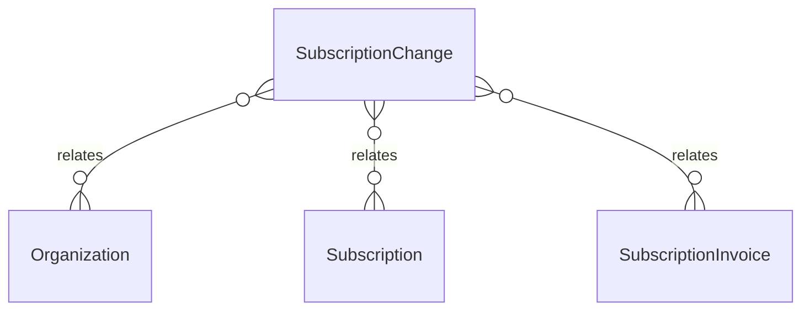

# `SubscriptionChange` → `subscription_changes`

<!-- generated by .kb/generate.mjs — do not edit by hand -->

Declared at `packages/db/prisma/schema.prisma:1101`.

| property | value |
| --- | --- |
| table | `subscription_changes` |
| tenant-scoped | yes — has `organizationId` |
| RLS | `org` policy |
| columns | 17 |
| relations | 3 |

## Columns

| column | type | definition |
| --- | --- | --- |
| `id` | `String` | `id String @id @default(uuid()) @db.Uuid` |
| `organizationId` | `String` | `organizationId String @map("organization_id") @db.Uuid` |
| `subscriptionId` | `String` | `subscriptionId String @map("subscription_id") @db.Uuid` |
| `changeType` | `SubscriptionChangeType` | `changeType SubscriptionChangeType @map("change_type")` |
| `fromPlanId` | `String?` | `fromPlanId String? @map("from_plan_id") @db.Uuid` |
| `fromPlanPriceId` | `String?` | `fromPlanPriceId String? @map("from_plan_price_id") @db.Uuid` |
| `toPlanId` | `String?` | `toPlanId String? @map("to_plan_id") @db.Uuid` |
| `toPlanPriceId` | `String?` | `toPlanPriceId String? @map("to_plan_price_id") @db.Uuid` |
| `currency` | `String` | `currency String @db.Char(3)` |
| `prorationCredit` | `Decimal` | `prorationCredit Decimal @default(0) @map("proration_credit") @db.Decimal(14, 2)` |
| `prorationCharge` | `Decimal` | `prorationCharge Decimal @default(0) @map("proration_charge") @db.Decimal(14, 2)` |
| `amountDue` | `Decimal` | `amountDue Decimal @default(0) @map("amount_due") @db.Decimal(14, 2)` |
| `invoiceId` | `String?` | `invoiceId String? @map("subscription_invoice_id") @db.Uuid` |
| `effectiveAt` | `DateTime` | `effectiveAt DateTime @map("effective_at") @db.Timestamptz(6)` |
| `actorUserId` | `String?` | `actorUserId String? @map("actor_user_id") @db.Uuid` |
| `reason` | `String?` | `reason String? @db.VarChar(500)` |
| `createdAt` | `DateTime` | `createdAt DateTime @default(now()) @map("created_at") @db.Timestamptz(6)` |

## Relations

| field | target | definition |
| --- | --- | --- |
| `organization` | [`Organization`](Organization.md) | `organization Organization @relation(fields: [organizationId], references: [id], onDelete: Cascade)` |
| `subscription` | [`Subscription`](Subscription.md) | `subscription Subscription @relation(fields: [organizationId, subscriptionId], references: [organizationId, id], onDelete: Cascade)` |
| `invoice` | [`SubscriptionInvoice`](SubscriptionInvoice.md) | `invoice SubscriptionInvoice? @relation(fields: [organizationId, invoiceId], references: [organizationId, id], onDelete: NoAction, onUpdate: NoAction)` |

## Indexes and constraints

- `@@index([organizationId, subscriptionId, createdAt])`

## Neighbourhood

