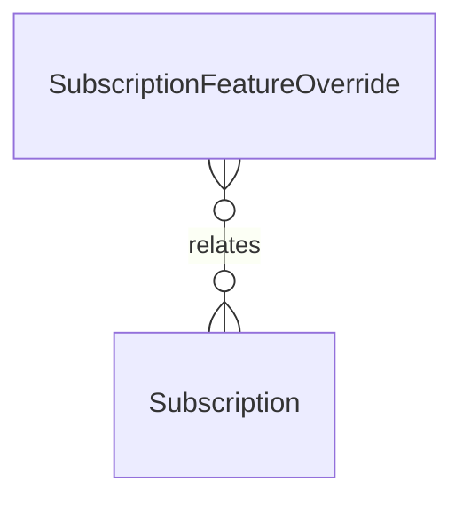

# `SubscriptionFeatureOverride` → `subscription_feature_overrides`

<!-- generated by .kb/generate.mjs — do not edit by hand -->

Declared at `packages/db/prisma/schema/subscriptions.prisma:253`.

| property | value |
| --- | --- |
| table | `subscription_feature_overrides` |
| tenant-scoped | no |
| RLS | `parent` policy |
| columns | 7 |
| relations | 1 |

## Columns

| column | type | definition |
| --- | --- | --- |
| `id` | `String` | `id String @id @default(uuid()) @db.Uuid` |
| `subscriptionId` | `String` | `subscriptionId String @map("subscription_id") @db.Uuid` |
| `featureKey` | `String` | `featureKey String @map("feature_key") @db.VarChar(64)` |
| `intValue` | `Int?` | `intValue Int? @map("int_value")` |
| `boolValue` | `Boolean?` | `boolValue Boolean? @map("bool_value")` |
| `reason` | `String?` | `reason String? @db.VarChar(255)` |
| `createdAt` | `DateTime` | `createdAt DateTime @default(now()) @map("created_at") @db.Timestamptz(6)` |

## Relations

| field | target | definition |
| --- | --- | --- |
| `subscription` | [`Subscription`](Subscription.md) | `subscription Subscription @relation(fields: [subscriptionId], references: [id], onDelete: Cascade)` |

## Indexes and constraints

- `@@unique([subscriptionId, featureKey])`

## Neighbourhood

