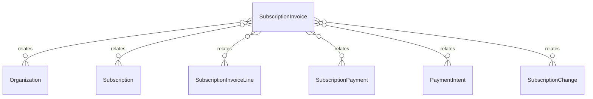

# `SubscriptionInvoice` → `subscription_invoices`

<!-- generated by .kb/generate.mjs — do not edit by hand -->

Declared at `packages/db/prisma/schema.prisma:832`.

| property | value |
| --- | --- |
| table | `subscription_invoices` |
| tenant-scoped | yes — has `organizationId` |
| RLS | `org` policy |
| columns | 22 |
| relations | 6 |

## Columns

| column | type | definition |
| --- | --- | --- |
| `id` | `String` | `id String @id @default(uuid()) @db.Uuid` |
| `organizationId` | `String` | `organizationId String @map("organization_id") @db.Uuid` |
| `subscriptionId` | `String` | `subscriptionId String @map("subscription_id") @db.Uuid` |
| `invoiceNumber` | `String` | `invoiceNumber String @unique @map("invoice_number") @db.VarChar(64)` |
| `periodStart` | `DateTime` | `periodStart DateTime @map("period_start") @db.Date` |
| `periodEnd` | `DateTime` | `periodEnd DateTime @map("period_end") @db.Date` |
| `currency` | `String` | `currency String @default("INR") @db.Char(3)` |
| `subtotal` | `Decimal` | `subtotal Decimal @db.Decimal(14, 2)` |
| `taxAmount` | `Decimal` | `taxAmount Decimal @default(0) @map("tax_amount") @db.Decimal(14, 2)` |
| `total` | `Decimal` | `total Decimal @db.Decimal(14, 2)` |
| `placeOfSupply` | `String?` | `placeOfSupply String? @map("place_of_supply") @db.VarChar(10)` |
| `taxTreatment` | `TaxTreatment` | `taxTreatment TaxTreatment @default(NOT_REGISTERED) @map("tax_treatment")` |
| `supplierTaxId` | `String?` | `supplierTaxId String? @map("supplier_tax_id") @db.VarChar(64)` |
| `customerTaxId` | `String?` | `customerTaxId String? @map("customer_tax_id") @db.VarChar(64)` |
| `amountPaid` | `Decimal` | `amountPaid Decimal @default(0) @map("amount_paid") @db.Decimal(14, 2)` |
| `status` | `SubscriptionInvoiceStatus` | `status SubscriptionInvoiceStatus @default(DRAFT)` |
| `dueDate` | `DateTime?` | `dueDate DateTime? @map("due_date") @db.Date` |
| `paidAt` | `DateTime?` | `paidAt DateTime? @map("paid_at") @db.Timestamptz(6)` |
| `voidedAt` | `DateTime?` | `voidedAt DateTime? @map("voided_at") @db.Timestamptz(6)` |
| `attemptCount` | `Int` | `attemptCount Int @default(0) @map("attempt_count") @db.SmallInt` |
| `createdAt` | `DateTime` | `createdAt DateTime @default(now()) @map("created_at") @db.Timestamptz(6)` |
| `updatedAt` | `DateTime` | `updatedAt DateTime @updatedAt @map("updated_at") @db.Timestamptz(6)` |

## Relations

| field | target | definition |
| --- | --- | --- |
| `organization` | [`Organization`](Organization.md) | `organization Organization @relation(fields: [organizationId], references: [id], onDelete: Cascade)` |
| `subscription` | [`Subscription`](Subscription.md) | `subscription Subscription @relation(fields: [subscriptionId], references: [id], onDelete: Cascade)` |
| `lines` | [`SubscriptionInvoiceLine`](SubscriptionInvoiceLine.md) | `lines SubscriptionInvoiceLine[]` |
| `payments` | [`SubscriptionPayment`](SubscriptionPayment.md) | `payments SubscriptionPayment[]` |
| `intents` | [`PaymentIntent`](PaymentIntent.md) | `intents PaymentIntent[]` |
| `changes` | [`SubscriptionChange`](SubscriptionChange.md) | `changes SubscriptionChange[]` |

## Indexes and constraints

- `@@unique([organizationId, id])`
- `@@index([organizationId, status])`
- `@@index([subscriptionId, createdAt])`

## Neighbourhood

