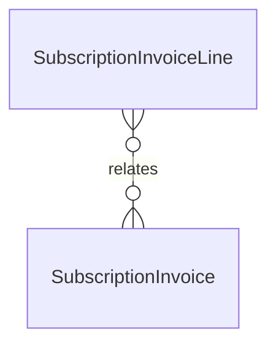

# `SubscriptionInvoiceLine` → `subscription_invoice_lines`

<!-- generated by .kb/generate.mjs — do not edit by hand -->

Declared at `packages/db/prisma/schema.prisma:706`.

| property | value |
| --- | --- |
| table | `subscription_invoice_lines` |
| tenant-scoped | no |
| RLS | `parent` policy |
| columns | 12 |
| relations | 1 |

## Columns

| column | type | definition |
| --- | --- | --- |
| `id` | `String` | `id String @id @default(uuid()) @db.Uuid` |
| `subscriptionInvoiceId` | `String` | `subscriptionInvoiceId String @map("subscription_invoice_id") @db.Uuid` |
| `kind` | `InvoiceLineKind` | `kind InvoiceLineKind @default(SUBSCRIPTION)` |
| `description` | `String` | `description String @db.VarChar(255)` |
| `quantity` | `Decimal` | `quantity Decimal @default(1) @db.Decimal(14, 3)` |
| `unitAmount` | `Decimal` | `unitAmount Decimal @map("unit_amount") @db.Decimal(14, 2)` |
| `lineTotal` | `Decimal` | `lineTotal Decimal @map("line_total") @db.Decimal(14, 2)` |
| `periodStart` | `DateTime?` | `periodStart DateTime? @map("period_start") @db.Date` |
| `periodEnd` | `DateTime?` | `periodEnd DateTime? @map("period_end") @db.Date` |
| `taxRateBps` | `Int?` | `taxRateBps Int? @map("tax_rate_bps")` |
| `taxName` | `String?` | `taxName String? @map("tax_name") @db.VarChar(32)` |
| `taxJurisdiction` | `String?` | `taxJurisdiction String? @map("tax_jurisdiction") @db.VarChar(10)` |

## Relations

| field | target | definition |
| --- | --- | --- |
| `invoice` | [`SubscriptionInvoice`](SubscriptionInvoice.md) | `invoice SubscriptionInvoice @relation(fields: [subscriptionInvoiceId], references: [id], onDelete: Cascade)` |

## Indexes and constraints

- `@@index([subscriptionInvoiceId])`

## Neighbourhood

