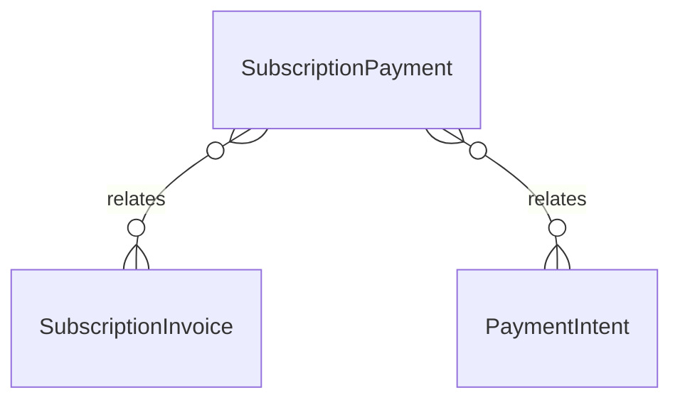

# `SubscriptionPayment` → `subscription_payments`

<!-- generated by .kb/generate.mjs — do not edit by hand -->

Declared at `packages/db/prisma/schema/subscriptions.prisma:360`.

| property | value |
| --- | --- |
| table | `subscription_payments` |
| tenant-scoped | no |
| RLS | `parent` policy |
| columns | 15 |
| relations | 2 |

## Columns

| column | type | definition |
| --- | --- | --- |
| `id` | `String` | `id String @id @default(uuid()) @db.Uuid` |
| `subscriptionInvoiceId` | `String` | `subscriptionInvoiceId String @map("subscription_invoice_id") @db.Uuid` |
| `paymentIntentId` | `String?` | `paymentIntentId String? @map("payment_intent_id") @db.Uuid` |
| `amount` | `Decimal` | `amount Decimal @db.Decimal(14, 2)` |
| `currency` | `String` | `currency String @default("INR") @db.Char(3)` |
| `method` | `String?` | `method String? @db.VarChar(32)` |
| `instrumentLabel` | `String?` | `instrumentLabel String? @map("instrument_label") @db.VarChar(32)` |
| `gateway` | `String?` | `gateway String? @db.VarChar(32)` |
| `gatewayPaymentId` | `String?` | `gatewayPaymentId String? @map("gateway_payment_id") @db.VarChar(128)` |
| `status` | `PaymentStatus` | `status PaymentStatus @default(PENDING)` |
| `failureCode` | `String?` | `failureCode String? @map("failure_code") @db.VarChar(64)` |
| `failureMessage` | `String?` | `failureMessage String? @map("failure_message") @db.VarChar(500)` |
| `refundedAmount` | `Decimal` | `refundedAmount Decimal @default(0) @map("refunded_amount") @db.Decimal(14, 2)` |
| `paidAt` | `DateTime?` | `paidAt DateTime? @map("paid_at") @db.Timestamptz(6)` |
| `createdAt` | `DateTime` | `createdAt DateTime @default(now()) @map("created_at") @db.Timestamptz(6)` |

## Relations

| field | target | definition |
| --- | --- | --- |
| `invoice` | [`SubscriptionInvoice`](SubscriptionInvoice.md) | `invoice SubscriptionInvoice @relation(fields: [subscriptionInvoiceId], references: [id], onDelete: Cascade)` |
| `intent` | [`PaymentIntent`](PaymentIntent.md) | `intent PaymentIntent? @relation(fields: [paymentIntentId], references: [id], onDelete: SetNull)` |

## Indexes and constraints

- `@@unique([gateway, gatewayPaymentId])`
- `@@index([subscriptionInvoiceId])`

## Neighbourhood

