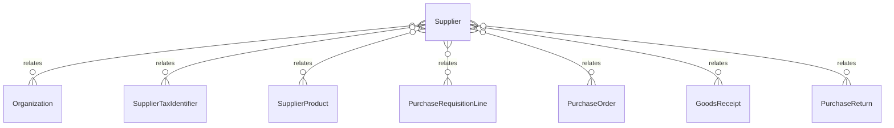

# `Supplier` → `suppliers`

<!-- generated by .kb/generate.mjs — do not edit by hand -->

Declared at `packages/db/prisma/schema/procurement.prisma:194`.

| property | value |
| --- | --- |
| table | `suppliers` |
| tenant-scoped | yes — has `organizationId` |
| RLS | `org` policy |
| columns | 23 |
| relations | 7 |

## Columns

| column | type | definition |
| --- | --- | --- |
| `id` | `String` | `id String @id @default(uuid()) @db.Uuid` |
| `organizationId` | `String` | `organizationId String @map("organization_id") @db.Uuid` |
| `code` | `String` | `code String @db.VarChar(64)` |
| `name` | `String` | `name String @db.VarChar(255)` |
| `legalName` | `String?` | `legalName String? @map("legal_name") @db.VarChar(255)` |
| `status` | `SupplierStatus` | `status SupplierStatus @default(ACTIVE)` |
| `contactPerson` | `String?` | `contactPerson String? @map("contact_person") @db.VarChar(255)` |
| `email` | `String?` | `email String? @db.VarChar(320)` |
| `phone` | `String?` | `phone String? @db.VarChar(32)` |
| `website` | `String?` | `website String? @db.VarChar(255)` |
| `addressLine1` | `String?` | `addressLine1 String? @map("address_line1") @db.VarChar(255)` |
| `addressLine2` | `String?` | `addressLine2 String? @map("address_line2") @db.VarChar(255)` |
| `city` | `String?` | `city String? @db.VarChar(128)` |
| `regionCode` | `String?` | `regionCode String? @map("region_code") @db.VarChar(10)` |
| `postalCode` | `String?` | `postalCode String? @map("postal_code") @db.VarChar(20)` |
| `countryCode` | `String?` | `countryCode String? @map("country_code") @db.Char(2)` |
| `defaultCurrency` | `String?` | `defaultCurrency String? @map("default_currency") @db.Char(3)` |
| `paymentTermsDays` | `Int?` | `paymentTermsDays Int? @map("payment_terms_days") @db.SmallInt` |
| `leadTimeDays` | `Int?` | `leadTimeDays Int? @map("lead_time_days") @db.SmallInt` |
| `notes` | `String?` | `notes String? @db.Text` |
| `createdAt` | `DateTime` | `createdAt DateTime @default(now()) @map("created_at") @db.Timestamptz(6)` |
| `updatedAt` | `DateTime` | `updatedAt DateTime @updatedAt @map("updated_at") @db.Timestamptz(6)` |
| `deletedAt` | `DateTime?` | `deletedAt DateTime? @map("deleted_at") @db.Timestamptz(6)` |

## Relations

| field | target | definition |
| --- | --- | --- |
| `organization` | [`Organization`](Organization.md) | `organization Organization @relation(fields: [organizationId], references: [id], onDelete: Cascade)` |
| `taxIdentifiers` | [`SupplierTaxIdentifier`](SupplierTaxIdentifier.md) | `taxIdentifiers SupplierTaxIdentifier[]` |
| `products` | [`SupplierProduct`](SupplierProduct.md) | `products SupplierProduct[]` |
| `requisitionLines` | [`PurchaseRequisitionLine`](PurchaseRequisitionLine.md) | `requisitionLines PurchaseRequisitionLine[]` |
| `purchaseOrders` | [`PurchaseOrder`](PurchaseOrder.md) | `purchaseOrders PurchaseOrder[]` |
| `goodsReceipts` | [`GoodsReceipt`](GoodsReceipt.md) | `goodsReceipts GoodsReceipt[]` |
| `returns` | [`PurchaseReturn`](PurchaseReturn.md) | `returns PurchaseReturn[]` |

## Indexes and constraints

- `@@unique([organizationId, code])`
- `@@unique([organizationId, id])`
- `@@index([organizationId, status, name])`

## Neighbourhood

