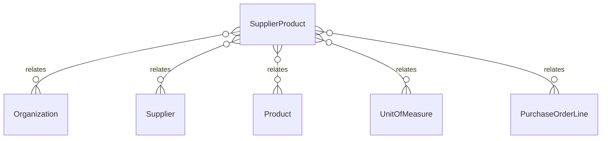

# `SupplierProduct` → `supplier_products`

<!-- generated by .kb/generate.mjs — do not edit by hand -->

Declared at `packages/db/prisma/schema/procurement.prisma:341`.

| property | value |
| --- | --- |
| table | `supplier_products` |
| tenant-scoped | yes — has `organizationId` |
| RLS | `visible` policy |
| columns | 20 |
| relations | 5 |

## Columns

| column | type | definition |
| --- | --- | --- |
| `id` | `String` | `id String @id @default(uuid()) @db.Uuid` |
| `organizationId` | `String` | `organizationId String @map("organization_id") @db.Uuid` |
| `supplierId` | `String` | `supplierId String @map("supplier_id") @db.Uuid` |
| `productId` | `String` | `productId String @map("product_id") @db.Uuid` |
| `supplierSku` | `String` | `supplierSku String @map("supplier_sku") @db.VarChar(128)` |
| `supplierProductName` | `String?` | `supplierProductName String? @map("supplier_product_name") @db.VarChar(255)` |
| `packUnitId` | `String` | `packUnitId String @map("pack_unit_id") @db.Uuid` |
| `quantityPerPack` | `Decimal` | `quantityPerPack Decimal @map("quantity_per_pack") @db.Decimal(18, 6)` |
| `pricePerPackMinor` | `BigInt` | `pricePerPackMinor BigInt @map("price_per_pack_minor") @db.BigInt` |
| `currency` | `String` | `currency String @db.Char(3)` |
| `priceEffectiveFrom` | `DateTime` | `priceEffectiveFrom DateTime @map("price_effective_from") @db.Date` |
| `priceEffectiveTo` | `DateTime?` | `priceEffectiveTo DateTime? @map("price_effective_to") @db.Date` |
| `leadTimeDays` | `Int?` | `leadTimeDays Int? @map("lead_time_days") @db.SmallInt` |
| `minimumOrderPacks` | `Decimal?` | `minimumOrderPacks Decimal? @map("minimum_order_packs") @db.Decimal(18, 6)` |
| `isPreferred` | `Boolean` | `isPreferred Boolean @default(false) @map("is_preferred")` |
| `isActive` | `Boolean` | `isActive Boolean @default(true) @map("is_active")` |
| `notes` | `String?` | `notes String? @db.Text` |
| `createdAt` | `DateTime` | `createdAt DateTime @default(now()) @map("created_at") @db.Timestamptz(6)` |
| `updatedAt` | `DateTime` | `updatedAt DateTime @updatedAt @map("updated_at") @db.Timestamptz(6)` |
| `deletedAt` | `DateTime?` | `deletedAt DateTime? @map("deleted_at") @db.Timestamptz(6)` |

## Relations

| field | target | definition |
| --- | --- | --- |
| `organization` | [`Organization`](Organization.md) | `organization Organization @relation(fields: [organizationId], references: [id], onDelete: Cascade)` |
| `supplier` | [`Supplier`](Supplier.md) | `supplier Supplier @relation(fields: [organizationId, supplierId], references: [organizationId, id], onDelete: Cascade)` |
| `product` | [`Product`](Product.md) | `product Product @relation(fields: [productId], references: [id], onDelete: Restrict)` |
| `packUnit` | [`UnitOfMeasure`](UnitOfMeasure.md) | `packUnit UnitOfMeasure @relation("SupplierProductPackUnit", fields: [packUnitId], references: [id], onDelete: Restrict)` |
| `purchaseOrderLines` | [`PurchaseOrderLine`](PurchaseOrderLine.md) | `purchaseOrderLines PurchaseOrderLine[]` |

## Indexes and constraints

- `@@unique([organizationId, supplierId, productId, supplierSku])`
- `@@unique([organizationId, id])`
- `@@index([organizationId, productId, isActive])`
- `@@index([organizationId, supplierId, isActive])`

## Neighbourhood

