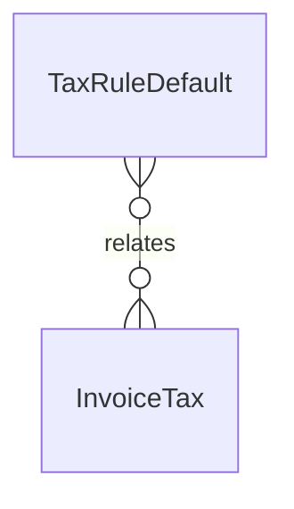

# `TaxRuleDefault` → `tax_rule_defaults`

<!-- generated by .kb/generate.mjs — do not edit by hand -->

Declared at `packages/db/prisma/schema/tax.prisma:396`.

| property | value |
| --- | --- |
| table | `tax_rule_defaults` |
| tenant-scoped | no |
| RLS | exempt — the published rate cards rcln maintains per country — the law, identical for every clinic in a jurisdiction, like plans… |
| columns | 18 |
| relations | 1 |

## Columns

| column | type | definition |
| --- | --- | --- |
| `id` | `String` | `id String @id @default(uuid()) @db.Uuid` |
| `countryCode` | `String` | `countryCode String @map("country_code") @db.Char(2)` |
| `regionCode` | `String?` | `regionCode String? @map("region_code") @db.VarChar(10)` |
| `scheme` | `TaxScheme` | `scheme TaxScheme` |
| `taxCategory` | `String` | `taxCategory String @map("tax_category") @db.VarChar(64)` |
| `description` | `String?` | `description String? @db.VarChar(255)` |
| `rateBps` | `Int` | `rateBps Int @map("rate_bps")` |
| `treatment` | `TaxTreatment` | `treatment TaxTreatment @default(STANDARD)` |
| `lineName` | `String` | `lineName String @map("line_name") @db.VarChar(32)` |
| `regionalLineName` | `String?` | `regionalLineName String? @map("regional_line_name") @db.VarChar(32)` |
| `split` | `TaxSplit` | `split TaxSplit @default(NONE)` |
| `stacks` | `Boolean` | `stacks Boolean @default(false)` |
| `sourceNote` | `String?` | `sourceNote String? @map("source_note") @db.VarChar(500)` |
| `effectiveFrom` | `DateTime` | `effectiveFrom DateTime @map("effective_from") @db.Date` |
| `effectiveTo` | `DateTime?` | `effectiveTo DateTime? @map("effective_to") @db.Date` |
| `createdAt` | `DateTime` | `createdAt DateTime @default(now()) @map("created_at") @db.Timestamptz(6)` |
| `updatedAt` | `DateTime` | `updatedAt DateTime @updatedAt @map("updated_at") @db.Timestamptz(6)` |
| `deletedAt` | `DateTime?` | `deletedAt DateTime? @map("deleted_at") @db.Timestamptz(6)` |

## Relations

| field | target | definition |
| --- | --- | --- |
| `invoiceTaxes` | [`InvoiceTax`](InvoiceTax.md) | `invoiceTaxes InvoiceTax[]` |

## Indexes and constraints

- `@@unique([countryCode, regionCode, scheme, taxCategory, effectiveFrom])`
- `@@index([countryCode, taxCategory, effectiveFrom])`

## Neighbourhood

