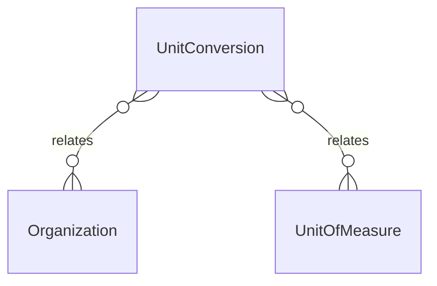

# `UnitConversion` → `unit_conversions`

<!-- generated by .kb/generate.mjs — do not edit by hand -->

Declared at `packages/db/prisma/schema/products.prisma:344`.

| property | value |
| --- | --- |
| table | `unit_conversions` |
| tenant-scoped | yes — has `organizationId` |
| RLS | `visible` policy |
| columns | 8 |
| relations | 3 |

## Columns

| column | type | definition |
| --- | --- | --- |
| `id` | `String` | `id String @id @default(uuid()) @db.Uuid` |
| `organizationId` | `String?` | `organizationId String? @map("organization_id") @db.Uuid` |
| `fromUnitId` | `String` | `fromUnitId String @map("from_unit_id") @db.Uuid` |
| `toUnitId` | `String` | `toUnitId String @map("to_unit_id") @db.Uuid` |
| `numerator` | `BigInt` | `numerator BigInt @db.BigInt` |
| `denominator` | `BigInt` | `denominator BigInt @default(1) @db.BigInt` |
| `createdAt` | `DateTime` | `createdAt DateTime @default(now()) @map("created_at") @db.Timestamptz(6)` |
| `updatedAt` | `DateTime` | `updatedAt DateTime @updatedAt @map("updated_at") @db.Timestamptz(6)` |

## Relations

| field | target | definition |
| --- | --- | --- |
| `organization` | [`Organization`](Organization.md) | `organization Organization? @relation(fields: [organizationId], references: [id], onDelete: Cascade)` |
| `fromUnit` | [`UnitOfMeasure`](UnitOfMeasure.md) | `fromUnit UnitOfMeasure @relation("ConversionFromUnit", fields: [fromUnitId], references: [id], onDelete: Restrict)` |
| `toUnit` | [`UnitOfMeasure`](UnitOfMeasure.md) | `toUnit UnitOfMeasure @relation("ConversionToUnit", fields: [toUnitId], references: [id], onDelete: Restrict)` |

## Indexes and constraints

- `@@unique([organizationId, fromUnitId, toUnitId])`
- `@@index([organizationId, fromUnitId])`
- `@@index([organizationId, toUnitId])`

## Neighbourhood

