# `UnitOfMeasure` → `units_of_measure`

<!-- generated by .kb/generate.mjs — do not edit by hand -->

Declared at `packages/db/prisma/schema/products.prisma:270`.

| property | value |
| --- | --- |
| table | `units_of_measure` |
| tenant-scoped | yes — has `organizationId` |
| RLS | **MISSING — this is a tenant-isolation defect** |
| columns | 10 |
| relations | 16 |

## Columns

| column | type | definition |
| --- | --- | --- |
| `id` | `String` | `id String @id @default(uuid()) @db.Uuid` |
| `organizationId` | `String?` | `organizationId String? @map("organization_id") @db.Uuid` |
| `code` | `String` | `code String @db.VarChar(32)` |
| `name` | `String` | `name String @db.VarChar(128)` |
| `symbol` | `String` | `symbol String @db.VarChar(16)` |
| `unitClass` | `UnitClass` | `unitClass UnitClass @map("unit_class")` |
| `isBase` | `Boolean` | `isBase Boolean @default(false) @map("is_base")` |
| `isActive` | `Boolean` | `isActive Boolean @default(true) @map("is_active")` |
| `createdAt` | `DateTime` | `createdAt DateTime @default(now()) @map("created_at") @db.Timestamptz(6)` |
| `updatedAt` | `DateTime` | `updatedAt DateTime @updatedAt @map("updated_at") @db.Timestamptz(6)` |

## Relations

| field | target | definition |
| --- | --- | --- |
| `organization` | [`Organization`](Organization.md) | `organization Organization? @relation(fields: [organizationId], references: [id], onDelete: Cascade)` |
| `conversionsFrom` | [`UnitConversion`](UnitConversion.md) | `conversionsFrom UnitConversion[] @relation("ConversionFromUnit")` |
| `conversionsTo` | [`UnitConversion`](UnitConversion.md) | `conversionsTo UnitConversion[] @relation("ConversionToUnit")` |
| `baseForProducts` | [`Product`](Product.md) | `baseForProducts Product[] @relation("ProductBaseUnit")` |
| `packagings` | [`ProductPackaging`](ProductPackaging.md) | `packagings ProductPackaging[]` |
| `ingredientStrength` | [`CompositionIngredient`](CompositionIngredient.md) | `ingredientStrength CompositionIngredient[] @relation("IngredientStrengthUnit")` |
| `stockLedgerEntries` | [`StockLedgerEntry`](StockLedgerEntry.md) | `stockLedgerEntries StockLedgerEntry[]` |
| `transferLines` | [`StockTransferLine`](StockTransferLine.md) | `transferLines StockTransferLine[] @relation("TransferLineUnit")` |
| `supplierPackUnits` | [`SupplierProduct`](SupplierProduct.md) | `supplierPackUnits SupplierProduct[] @relation("SupplierProductPackUnit")` |
| `requisitionLines` | [`PurchaseRequisitionLine`](PurchaseRequisitionLine.md) | `requisitionLines PurchaseRequisitionLine[] @relation("RequisitionLineUnit")` |
| `purchaseOrderLines` | [`PurchaseOrderLine`](PurchaseOrderLine.md) | `purchaseOrderLines PurchaseOrderLine[] @relation("PurchaseOrderLineUnit")` |
| `goodsReceiptLines` | [`GoodsReceiptLine`](GoodsReceiptLine.md) | `goodsReceiptLines GoodsReceiptLine[] @relation("GoodsReceiptLineUnit")` |
| `purchaseReturnLines` | [`PurchaseReturnLine`](PurchaseReturnLine.md) | `purchaseReturnLines PurchaseReturnLine[] @relation("PurchaseReturnLineUnit")` |
| `dispenseLines` | [`DispenseLine`](DispenseLine.md) | `dispenseLines DispenseLine[] @relation("DispenseLineUnit")` |
| `productPrices` | [`ProductPrice`](ProductPrice.md) | `productPrices ProductPrice[] @relation("ProductPriceUnit")` |
| `chargeRequests` | [`ChargeRequest`](ChargeRequest.md) | `chargeRequests ChargeRequest[] @relation("ChargeRequestUnit")` |

## Indexes and constraints

- `@@unique([organizationId, code])`
- `@@unique([organizationId, id])`
- `@@index([organizationId, unitClass, isActive])`

## Neighbourhood

```mermaid
erDiagram
    UnitOfMeasure }o--o{ Organization : relates
    UnitOfMeasure }o--o{ UnitConversion : relates
    UnitOfMeasure }o--o{ Product : relates
    UnitOfMeasure }o--o{ ProductPackaging : relates
    UnitOfMeasure }o--o{ CompositionIngredient : relates
    UnitOfMeasure }o--o{ StockLedgerEntry : relates
    UnitOfMeasure }o--o{ StockTransferLine : relates
    UnitOfMeasure }o--o{ SupplierProduct : relates
    UnitOfMeasure }o--o{ PurchaseRequisitionLine : relates
    UnitOfMeasure }o--o{ PurchaseOrderLine : relates
    UnitOfMeasure }o--o{ GoodsReceiptLine : relates
    UnitOfMeasure }o--o{ PurchaseReturnLine : relates
    UnitOfMeasure }o--o{ DispenseLine : relates
    UnitOfMeasure }o--o{ ProductPrice : relates
    UnitOfMeasure }o--o{ ChargeRequest : relates
```

