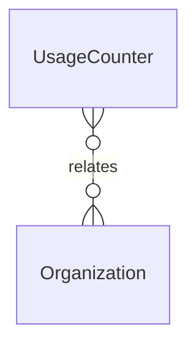

# `UsageCounter` → `usage_counters`

<!-- generated by .kb/generate.mjs — do not edit by hand -->

Declared at `packages/db/prisma/schema.prisma:952`.

| property | value |
| --- | --- |
| table | `usage_counters` |
| tenant-scoped | yes — has `organizationId` |
| RLS | `org` policy |
| columns | 6 |
| relations | 1 |

## Columns

| column | type | definition |
| --- | --- | --- |
| `id` | `String` | `id String @id @default(uuid()) @db.Uuid` |
| `organizationId` | `String` | `organizationId String @map("organization_id") @db.Uuid` |
| `featureKey` | `String` | `featureKey String @map("feature_key") @db.VarChar(64)` |
| `periodStart` | `DateTime` | `periodStart DateTime @map("period_start") @db.Date` |
| `usedValue` | `Decimal` | `usedValue Decimal @default(0) @map("used_value") @db.Decimal(14, 2)` |
| `updatedAt` | `DateTime` | `updatedAt DateTime @updatedAt @map("updated_at") @db.Timestamptz(6)` |

## Relations

| field | target | definition |
| --- | --- | --- |
| `organization` | [`Organization`](Organization.md) | `organization Organization @relation(fields: [organizationId], references: [id], onDelete: Cascade)` |

## Indexes and constraints

- `@@unique([organizationId, featureKey, periodStart])`

## Neighbourhood

