# `User` → `users`

<!-- generated by .kb/generate.mjs — do not edit by hand -->

Declared at `packages/db/prisma/schema/identity.prisma:24`.

| property | value |
| --- | --- |
| table | `users` |
| tenant-scoped | no |
| RLS | exempt — global identity — one login spans organizations |
| columns | 20 |
| relations | 55 |

## Columns

| column | type | definition |
| --- | --- | --- |
| `id` | `String` | `id String @id @default(uuid()) @db.Uuid` |
| `email` | `String?` | `email String? @unique @db.VarChar(255)` |
| `phone` | `String?` | `phone String? @unique @db.VarChar(20)` |
| `passwordHash` | `String?` | `passwordHash String? @map("password_hash") @db.VarChar(255)` |
| `fullName` | `String` | `fullName String @map("full_name") @db.VarChar(255)` |
| `avatarFileId` | `String?` | `avatarFileId String? @map("avatar_file_id") @db.Uuid` |
| `status` | `UserStatus` | `status UserStatus @default(INVITED)` |
| `isPlatformAdmin` | `Boolean` | `isPlatformAdmin Boolean @default(false) @map("is_platform_admin")` |
| `mfaEnabled` | `Boolean` | `mfaEnabled Boolean @default(false) @map("mfa_enabled")` |
| `mfaSecret` | `String?` | `mfaSecret String? @map("mfa_secret") @db.VarChar(255)` |
| `locale` | `String` | `locale String @default("en") @db.VarChar(10)` |
| `lastPlatformOrganizationId` | `String?` | `lastPlatformOrganizationId String? @map("last_platform_organization_id") @db.Uuid` |
| `emailVerifiedAt` | `DateTime?` | `emailVerifiedAt DateTime? @map("email_verified_at") @db.Timestamptz(6)` |
| `phoneVerifiedAt` | `DateTime?` | `phoneVerifiedAt DateTime? @map("phone_verified_at") @db.Timestamptz(6)` |
| `lastLoginAt` | `DateTime?` | `lastLoginAt DateTime? @map("last_login_at") @db.Timestamptz(6)` |
| `failedAttempts` | `Int` | `failedAttempts Int @default(0) @map("failed_login_attempts") @db.SmallInt` |
| `lockedUntil` | `DateTime?` | `lockedUntil DateTime? @map("locked_until") @db.Timestamptz(6)` |
| `createdAt` | `DateTime` | `createdAt DateTime @default(now()) @map("created_at") @db.Timestamptz(6)` |
| `updatedAt` | `DateTime` | `updatedAt DateTime @updatedAt @map("updated_at") @db.Timestamptz(6)` |
| `deletedAt` | `DateTime?` | `deletedAt DateTime? @map("deleted_at") @db.Timestamptz(6)` |

## Relations

| field | target | definition |
| --- | --- | --- |
| `identities` | [`UserIdentity`](UserIdentity.md) | `identities UserIdentity[]` |
| `sessions` | [`Session`](Session.md) | `sessions Session[]` |
| `authTokens` | [`AuthToken`](AuthToken.md) | `authTokens AuthToken[]` |
| `memberships` | [`Membership`](Membership.md) | `memberships Membership[]` |
| `ownedOrganizations` | [`Organization`](Organization.md) | `ownedOrganizations Organization[] @relation("OrganizationOwner")` |
| `lastPlatformOrganization` | [`Organization`](Organization.md) | `lastPlatformOrganization Organization? @relation("PlatformAdminLastOrganization", fields: [lastPlatformOrganizationId], references: [id], onDelete: SetNull)` |
| `invitationsSent` | [`Invitation`](Invitation.md) | `invitationsSent Invitation[] @relation("InvitedBy")` |
| `auditLogs` | [`AuditLog`](AuditLog.md) | `auditLogs AuditLog[]` |
| `dataAccessLogs` | [`DataAccessLog`](DataAccessLog.md) | `dataAccessLogs DataAccessLog[]` |
| `uploadedFiles` | [`StoredFile`](StoredFile.md) | `uploadedFiles StoredFile[]` |
| `doctorProfiles` | [`DoctorProfile`](DoctorProfile.md) | `doctorProfiles DoctorProfile[]` |
| `patientRecords` | [`Patient`](Patient.md) | `patientRecords Patient[]` |
| `patientRegistrations` | [`PatientRegistration`](PatientRegistration.md) | `patientRegistrations PatientRegistration[] @relation("PatientRegisteredBy")` |
| `allergiesNoted` | [`PatientAllergy`](PatientAllergy.md) | `allergiesNoted PatientAllergy[] @relation("AllergyNotedBy")` |
| `conditionsNoted` | [`PatientCondition`](PatientCondition.md) | `conditionsNoted PatientCondition[] @relation("ConditionNotedBy")` |
| `medicationsNoted` | [`PatientMedication`](PatientMedication.md) | `medicationsNoted PatientMedication[] @relation("MedicationNotedBy")` |
| `appointmentsBooked` | [`Appointment`](Appointment.md) | `appointmentsBooked Appointment[] @relation("AppointmentBookedBy")` |
| `appointmentsCancelled` | [`Appointment`](Appointment.md) | `appointmentsCancelled Appointment[] @relation("AppointmentCancelledBy")` |
| `episodesOpened` | [`ClinicalEpisode`](ClinicalEpisode.md) | `episodesOpened ClinicalEpisode[] @relation("EpisodeOpenedBy")` |
| `episodesClosed` | [`ClinicalEpisode`](ClinicalEpisode.md) | `episodesClosed ClinicalEpisode[] @relation("EpisodeClosedBy")` |
| `recommendationsCancelled` | [`EncounterFollowUpRecommendation`](EncounterFollowUpRecommendation.md) | `recommendationsCancelled EncounterFollowUpRecommendation[] @relation("RecommendationCancelledBy")` |
| `templateVersionsPublished` | [`ConsultationTemplateVersion`](ConsultationTemplateVersion.md) | `templateVersionsPublished ConsultationTemplateVersion[] @relation("TemplateVersionPublishedBy")` |
| `encountersFinalized` | [`Encounter`](Encounter.md) | `encountersFinalized Encounter[] @relation("EncounterFinalizedBy")` |
| `encountersCancelled` | [`Encounter`](Encounter.md) | `encountersCancelled Encounter[] @relation("EncounterCancelledBy")` |
| `appointmentStatusChanges` | [`AppointmentStatusHistory`](AppointmentStatusHistory.md) | `appointmentStatusChanges AppointmentStatusHistory[] @relation("AppointmentStatusChangedBy")` |
| `vitalsRecorded` | [`AppointmentVital`](AppointmentVital.md) | `vitalsRecorded AppointmentVital[] @relation("VitalRecordedBy")` |
| `vitalsAmended` | [`AppointmentVital`](AppointmentVital.md) | `vitalsAmended AppointmentVital[] @relation("VitalSupersededBy")` |
| `invoicesCreated` | [`Invoice`](Invoice.md) | `invoicesCreated Invoice[] @relation("InvoiceCreatedBy")` |
| `invoicesIssued` | [`Invoice`](Invoice.md) | `invoicesIssued Invoice[] @relation("InvoiceIssuedBy")` |
| `invoicesCancelled` | [`Invoice`](Invoice.md) | `invoicesCancelled Invoice[] @relation("InvoiceCancelledBy")` |
| `invoiceDocumentsGenerated` | [`InvoiceDocument`](InvoiceDocument.md) | `invoiceDocumentsGenerated InvoiceDocument[] @relation("InvoiceDocumentGeneratedBy")` |
| `stockMovements` | [`StockLedgerEntry`](StockLedgerEntry.md) | `stockMovements StockLedgerEntry[]` |
| `transfersCreated` | [`StockTransfer`](StockTransfer.md) | `transfersCreated StockTransfer[] @relation("TransferCreatedBy")` |
| `transfersDispatched` | [`StockTransfer`](StockTransfer.md) | `transfersDispatched StockTransfer[] @relation("TransferDispatchedBy")` |
| `transfersReceived` | [`StockTransfer`](StockTransfer.md) | `transfersReceived StockTransfer[] @relation("TransferReceivedBy")` |
| `transfersCancelled` | [`StockTransfer`](StockTransfer.md) | `transfersCancelled StockTransfer[] @relation("TransferCancelledBy")` |
| `reservationsCreated` | [`StockReservation`](StockReservation.md) | `reservationsCreated StockReservation[] @relation("ReservationCreatedBy")` |
| `reservationsReleased` | [`StockReservation`](StockReservation.md) | `reservationsReleased StockReservation[] @relation("ReservationReleasedBy")` |
| `requisitionsCreated` | [`PurchaseRequisition`](PurchaseRequisition.md) | `requisitionsCreated PurchaseRequisition[] @relation("RequisitionCreatedBy")` |
| `requisitionsSubmitted` | [`PurchaseRequisition`](PurchaseRequisition.md) | `requisitionsSubmitted PurchaseRequisition[] @relation("RequisitionSubmittedBy")` |
| `requisitionsApproved` | [`PurchaseRequisition`](PurchaseRequisition.md) | `requisitionsApproved PurchaseRequisition[] @relation("RequisitionApprovedBy")` |
| `requisitionsRejected` | [`PurchaseRequisition`](PurchaseRequisition.md) | `requisitionsRejected PurchaseRequisition[] @relation("RequisitionRejectedBy")` |
| `requisitionsCancelled` | [`PurchaseRequisition`](PurchaseRequisition.md) | `requisitionsCancelled PurchaseRequisition[] @relation("RequisitionCancelledBy")` |
| `purchaseOrdersCreated` | [`PurchaseOrder`](PurchaseOrder.md) | `purchaseOrdersCreated PurchaseOrder[] @relation("PurchaseOrderCreatedBy")` |
| `purchaseOrdersIssued` | [`PurchaseOrder`](PurchaseOrder.md) | `purchaseOrdersIssued PurchaseOrder[] @relation("PurchaseOrderIssuedBy")` |
| `purchaseOrdersClosed` | [`PurchaseOrder`](PurchaseOrder.md) | `purchaseOrdersClosed PurchaseOrder[] @relation("PurchaseOrderClosedBy")` |
| `purchaseOrdersCancelled` | [`PurchaseOrder`](PurchaseOrder.md) | `purchaseOrdersCancelled PurchaseOrder[] @relation("PurchaseOrderCancelledBy")` |
| `goodsReceiptsCreated` | [`GoodsReceipt`](GoodsReceipt.md) | `goodsReceiptsCreated GoodsReceipt[] @relation("GoodsReceiptCreatedBy")` |
| `goodsReceiptsPosted` | [`GoodsReceipt`](GoodsReceipt.md) | `goodsReceiptsPosted GoodsReceipt[] @relation("GoodsReceiptPostedBy")` |
| `goodsReceiptsCancelled` | [`GoodsReceipt`](GoodsReceipt.md) | `goodsReceiptsCancelled GoodsReceipt[] @relation("GoodsReceiptCancelledBy")` |
| `qualityDecisions` | [`GoodsReceiptLine`](GoodsReceiptLine.md) | `qualityDecisions GoodsReceiptLine[] @relation("GoodsReceiptLineQualityDecidedBy")` |
| `purchaseReturnsCreated` | [`PurchaseReturn`](PurchaseReturn.md) | `purchaseReturnsCreated PurchaseReturn[] @relation("PurchaseReturnCreatedBy")` |
| `purchaseReturnsSent` | [`PurchaseReturn`](PurchaseReturn.md) | `purchaseReturnsSent PurchaseReturn[] @relation("PurchaseReturnSentBy")` |
| `purchaseReturnsCancelled` | [`PurchaseReturn`](PurchaseReturn.md) | `purchaseReturnsCancelled PurchaseReturn[] @relation("PurchaseReturnCancelledBy")` |
| `rulePacksReviewed` | [`RegulatoryRulePack`](RegulatoryRulePack.md) | `rulePacksReviewed RegulatoryRulePack[] @relation("RulePackReviewer")` |

## Indexes and constraints

- `@@index([status])`
- `@@index([isPlatformAdmin])`

## Neighbourhood

```mermaid
erDiagram
    User }o--o{ UserIdentity : relates
    User }o--o{ Session : relates
    User }o--o{ AuthToken : relates
    User }o--o{ Membership : relates
    User }o--o{ Organization : relates
    User }o--o{ Invitation : relates
    User }o--o{ AuditLog : relates
    User }o--o{ DataAccessLog : relates
    User }o--o{ StoredFile : relates
    User }o--o{ DoctorProfile : relates
    User }o--o{ Patient : relates
    User }o--o{ PatientRegistration : relates
    User }o--o{ PatientAllergy : relates
    User }o--o{ PatientCondition : relates
    User }o--o{ PatientMedication : relates
    User }o--o{ Appointment : relates
    User }o--o{ ClinicalEpisode : relates
    User }o--o{ EncounterFollowUpRecommendation : relates
    User }o--o{ ConsultationTemplateVersion : relates
    User }o--o{ Encounter : relates
    User }o--o{ AppointmentStatusHistory : relates
    User }o--o{ AppointmentVital : relates
    User }o--o{ Invoice : relates
    User }o--o{ InvoiceDocument : relates
    User }o--o{ StockLedgerEntry : relates
    User }o--o{ StockTransfer : relates
    User }o--o{ StockReservation : relates
    User }o--o{ PurchaseRequisition : relates
    User }o--o{ PurchaseOrder : relates
    User }o--o{ GoodsReceipt : relates
    User }o--o{ GoodsReceiptLine : relates
    User }o--o{ PurchaseReturn : relates
    User }o--o{ RegulatoryRulePack : relates
```

