# `User` → `users`

<!-- generated by .kb/generate.mjs — do not edit by hand -->

Declared at `packages/db/prisma/schema.prisma:1152`.

| property | value |
| --- | --- |
| table | `users` |
| tenant-scoped | no |
| RLS | exempt — global identity — one login spans organizations |
| columns | 20 |
| relations | 19 |

## Columns

| column | type | definition |
| --- | --- | --- |
| `id` | `String` | `id String @id @default(uuid()) @db.Uuid` |
| `email` | `String?` | `email String? @unique @db.VarChar(255)` |
| `phone` | `String?` | `phone String? @unique @db.VarChar(20)` |
| `passwordHash` | `String?` | `passwordHash String? @map("password_hash") @db.VarChar(255)` |
| `fullName` | `String` | `fullName String @map("full_name") @db.VarChar(255)` |
| `avatarFileId` | `String?` | `avatarFileId String? @map("avatar_file_id") @db.Uuid` |
| `status` | `UserStatus` | `status UserStatus @default(INVITED)` |
| `isPlatformAdmin` | `Boolean` | `isPlatformAdmin Boolean @default(false) @map("is_platform_admin")` |
| `mfaEnabled` | `Boolean` | `mfaEnabled Boolean @default(false) @map("mfa_enabled")` |
| `mfaSecret` | `String?` | `mfaSecret String? @map("mfa_secret") @db.VarChar(255)` |
| `locale` | `String` | `locale String @default("en") @db.VarChar(10)` |
| `lastPlatformOrganizationId` | `String?` | `lastPlatformOrganizationId String? @map("last_platform_organization_id") @db.Uuid` |
| `emailVerifiedAt` | `DateTime?` | `emailVerifiedAt DateTime? @map("email_verified_at") @db.Timestamptz(6)` |
| `phoneVerifiedAt` | `DateTime?` | `phoneVerifiedAt DateTime? @map("phone_verified_at") @db.Timestamptz(6)` |
| `lastLoginAt` | `DateTime?` | `lastLoginAt DateTime? @map("last_login_at") @db.Timestamptz(6)` |
| `failedAttempts` | `Int` | `failedAttempts Int @default(0) @map("failed_login_attempts") @db.SmallInt` |
| `lockedUntil` | `DateTime?` | `lockedUntil DateTime? @map("locked_until") @db.Timestamptz(6)` |
| `createdAt` | `DateTime` | `createdAt DateTime @default(now()) @map("created_at") @db.Timestamptz(6)` |
| `updatedAt` | `DateTime` | `updatedAt DateTime @updatedAt @map("updated_at") @db.Timestamptz(6)` |
| `deletedAt` | `DateTime?` | `deletedAt DateTime? @map("deleted_at") @db.Timestamptz(6)` |

## Relations

| field | target | definition |
| --- | --- | --- |
| `identities` | [`UserIdentity`](UserIdentity.md) | `identities UserIdentity[]` |
| `sessions` | [`Session`](Session.md) | `sessions Session[]` |
| `authTokens` | [`AuthToken`](AuthToken.md) | `authTokens AuthToken[]` |
| `memberships` | [`Membership`](Membership.md) | `memberships Membership[]` |
| `ownedOrganizations` | [`Organization`](Organization.md) | `ownedOrganizations Organization[] @relation("OrganizationOwner")` |
| `lastPlatformOrganization` | [`Organization`](Organization.md) | `lastPlatformOrganization Organization? @relation("PlatformAdminLastOrganization", fields: [lastPlatformOrganizationId], references: [id], onDelete: SetNull)` |
| `invitationsSent` | [`Invitation`](Invitation.md) | `invitationsSent Invitation[] @relation("InvitedBy")` |
| `auditLogs` | [`AuditLog`](AuditLog.md) | `auditLogs AuditLog[]` |
| `dataAccessLogs` | [`DataAccessLog`](DataAccessLog.md) | `dataAccessLogs DataAccessLog[]` |
| `uploadedFiles` | [`StoredFile`](StoredFile.md) | `uploadedFiles StoredFile[]` |
| `doctorProfiles` | [`DoctorProfile`](DoctorProfile.md) | `doctorProfiles DoctorProfile[]` |
| `patientRecords` | [`Patient`](Patient.md) | `patientRecords Patient[]` |
| `patientRegistrations` | [`PatientRegistration`](PatientRegistration.md) | `patientRegistrations PatientRegistration[] @relation("PatientRegisteredBy")` |
| `allergiesNoted` | [`PatientAllergy`](PatientAllergy.md) | `allergiesNoted PatientAllergy[] @relation("AllergyNotedBy")` |
| `conditionsNoted` | [`PatientCondition`](PatientCondition.md) | `conditionsNoted PatientCondition[] @relation("ConditionNotedBy")` |
| `medicationsNoted` | [`PatientMedication`](PatientMedication.md) | `medicationsNoted PatientMedication[] @relation("MedicationNotedBy")` |
| `appointmentsBooked` | [`Appointment`](Appointment.md) | `appointmentsBooked Appointment[] @relation("AppointmentBookedBy")` |
| `appointmentsCancelled` | [`Appointment`](Appointment.md) | `appointmentsCancelled Appointment[] @relation("AppointmentCancelledBy")` |
| `appointmentStatusChanges` | [`AppointmentStatusHistory`](AppointmentStatusHistory.md) | `appointmentStatusChanges AppointmentStatusHistory[] @relation("AppointmentStatusChangedBy")` |

## Indexes and constraints

- `@@index([status])`
- `@@index([isPlatformAdmin])`

## Neighbourhood

```mermaid
erDiagram
    User }o--o{ UserIdentity : relates
    User }o--o{ Session : relates
    User }o--o{ AuthToken : relates
    User }o--o{ Membership : relates
    User }o--o{ Organization : relates
    User }o--o{ Invitation : relates
    User }o--o{ AuditLog : relates
    User }o--o{ DataAccessLog : relates
    User }o--o{ StoredFile : relates
    User }o--o{ DoctorProfile : relates
    User }o--o{ Patient : relates
    User }o--o{ PatientRegistration : relates
    User }o--o{ PatientAllergy : relates
    User }o--o{ PatientCondition : relates
    User }o--o{ PatientMedication : relates
    User }o--o{ Appointment : relates
    User }o--o{ AppointmentStatusHistory : relates
```

