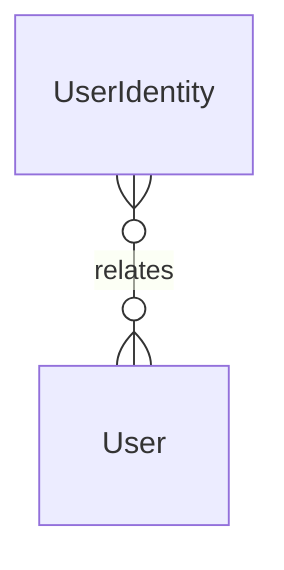

# `UserIdentity` → `user_identities`

<!-- generated by .kb/generate.mjs — do not edit by hand -->

Declared at `packages/db/prisma/schema.prisma:1686`.

| property | value |
| --- | --- |
| table | `user_identities` |
| tenant-scoped | no |
| RLS | exempt — SSO callback happens pre-context |
| columns | 5 |
| relations | 1 |

## Columns

| column | type | definition |
| --- | --- | --- |
| `id` | `String` | `id String @id @default(uuid()) @db.Uuid` |
| `userId` | `String` | `userId String @map("user_id") @db.Uuid` |
| `provider` | `String` | `provider String @db.VarChar(32)` |
| `providerUid` | `String` | `providerUid String @map("provider_uid") @db.VarChar(255)` |
| `createdAt` | `DateTime` | `createdAt DateTime @default(now()) @map("created_at") @db.Timestamptz(6)` |

## Relations

| field | target | definition |
| --- | --- | --- |
| `user` | [`User`](User.md) | `user User @relation(fields: [userId], references: [id], onDelete: Cascade)` |

## Indexes and constraints

- `@@unique([provider, providerUid])`
- `@@index([userId])`

## Neighbourhood

