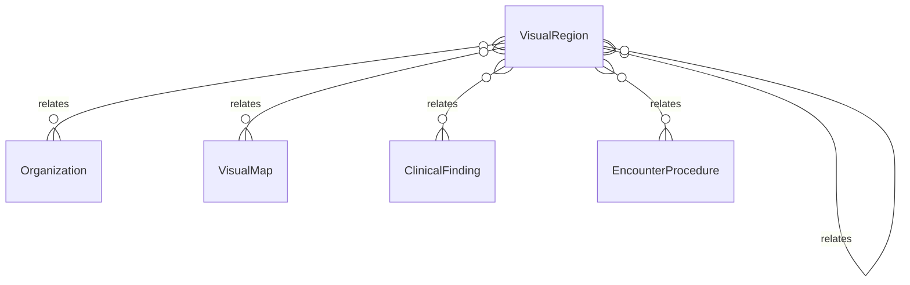

# `VisualRegion` → `visual_regions`

<!-- generated by .kb/generate.mjs — do not edit by hand -->

Declared at `packages/db/prisma/schema/clinical.prisma:1847`.

| property | value |
| --- | --- |
| table | `visual_regions` |
| tenant-scoped | yes — has `organizationId` |
| RLS | **MISSING — this is a tenant-isolation defect** |
| columns | 10 |
| relations | 6 |

## Columns

| column | type | definition |
| --- | --- | --- |
| `id` | `String` | `id String @id @default(uuid()) @db.Uuid` |
| `organizationId` | `String?` | `organizationId String? @map("organization_id") @db.Uuid` |
| `mapId` | `String` | `mapId String @map("map_id") @db.Uuid` |
| `code` | `String` | `code String @db.VarChar(64)` |
| `label` | `String` | `label String @db.VarChar(160)` |
| `parentId` | `String?` | `parentId String? @map("parent_id") @db.Uuid` |
| `displayOrder` | `Int` | `displayOrder Int @default(0) @map("display_order")` |
| `metadata` | `Json?` | `metadata Json? @db.JsonB` |
| `createdAt` | `DateTime` | `createdAt DateTime @default(now()) @map("created_at") @db.Timestamptz(6)` |
| `updatedAt` | `DateTime` | `updatedAt DateTime @updatedAt @map("updated_at") @db.Timestamptz(6)` |

## Relations

| field | target | definition |
| --- | --- | --- |
| `organization` | [`Organization`](Organization.md) | `organization Organization? @relation(fields: [organizationId], references: [id], onDelete: Cascade)` |
| `map` | [`VisualMap`](VisualMap.md) | `map VisualMap? @relation(fields: [organizationId, mapId], references: [organizationId, id], onDelete: Cascade)` |
| `parent` | [`VisualRegion`](VisualRegion.md) | `parent VisualRegion? @relation("VisualRegionParent", fields: [parentId], references: [id], onDelete: Restrict)` |
| `children` | [`VisualRegion`](VisualRegion.md) | `children VisualRegion[] @relation("VisualRegionParent")` |
| `findings` | [`ClinicalFinding`](ClinicalFinding.md) | `findings ClinicalFinding[]` |
| `procedures` | [`EncounterProcedure`](EncounterProcedure.md) | `procedures EncounterProcedure[] @relation("ProcedureRegion")` |

## Indexes and constraints

- `@@unique([organizationId, mapId, code])`
- `@@unique([organizationId, id])`
- `@@index([organizationId, mapId, displayOrder])`
- `@@index([parentId])`

## Neighbourhood

