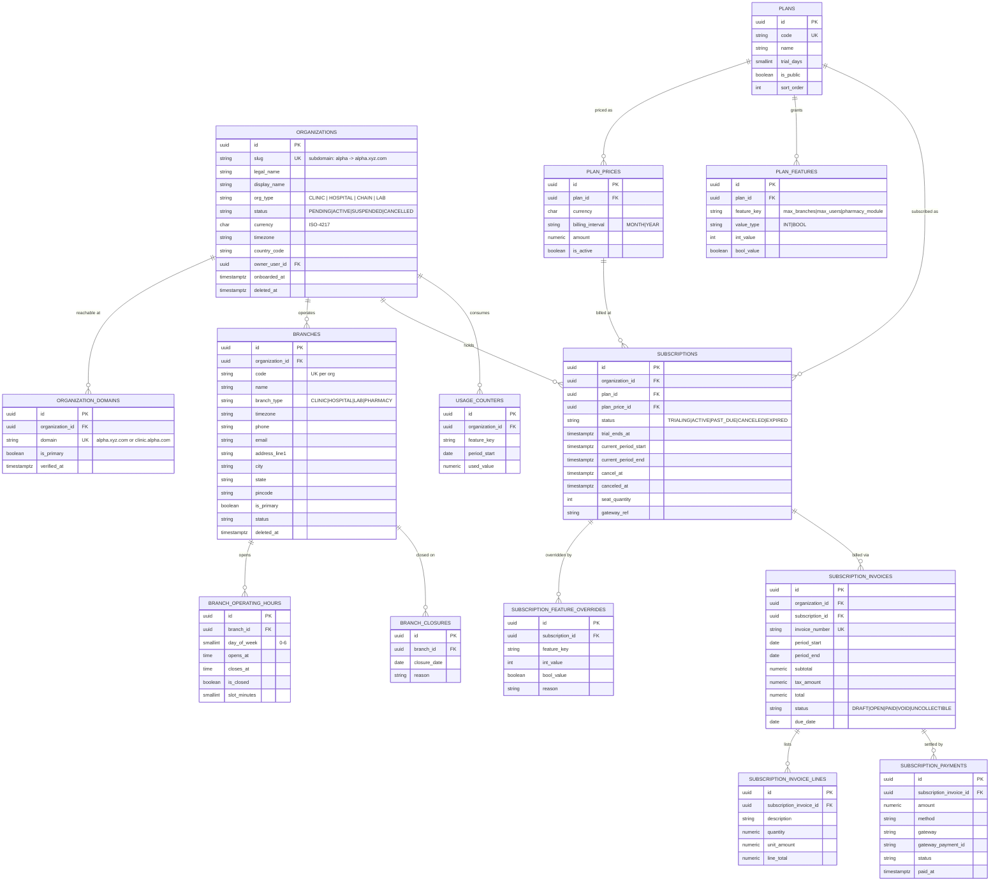
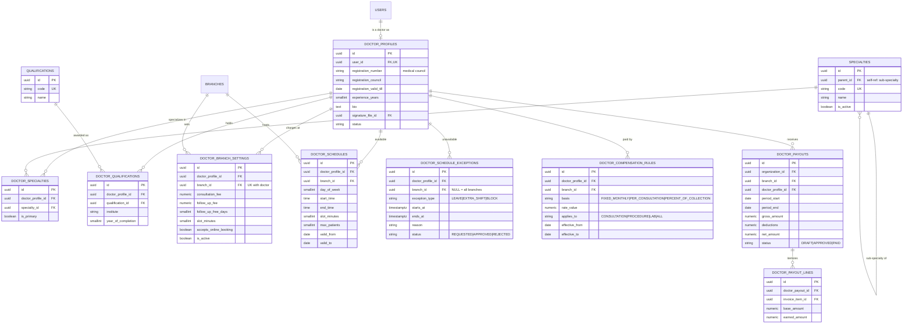
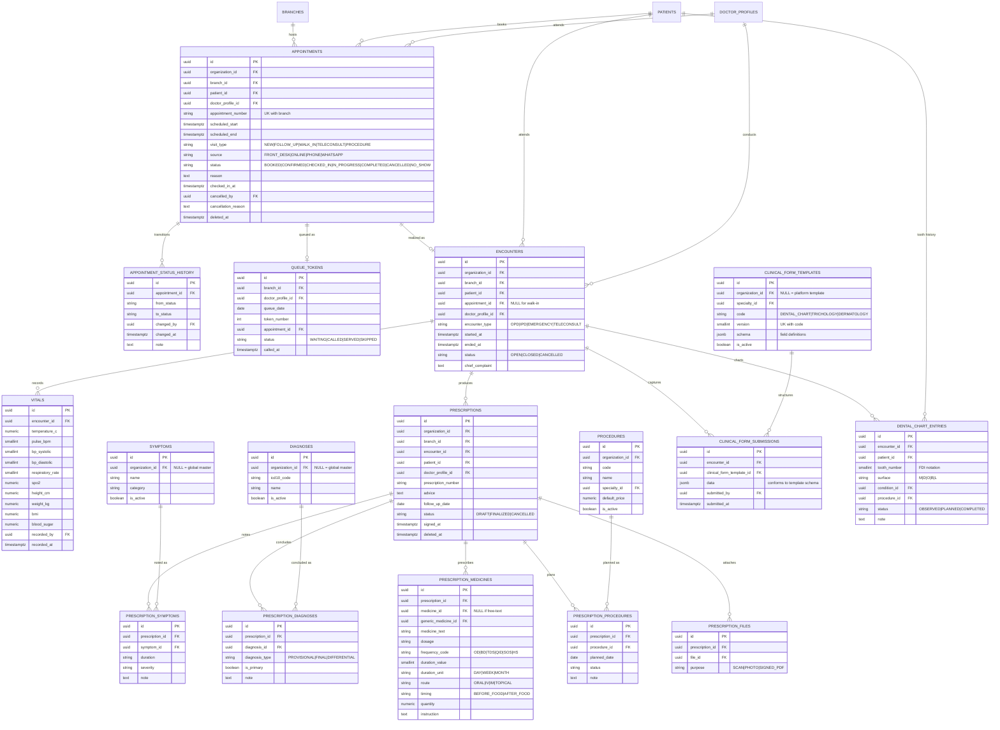
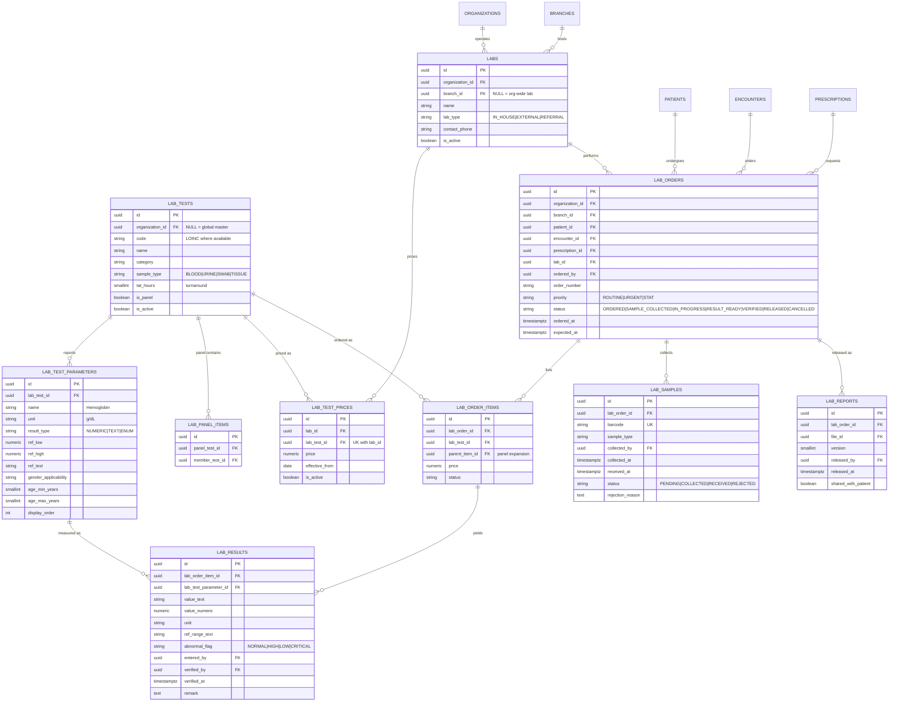
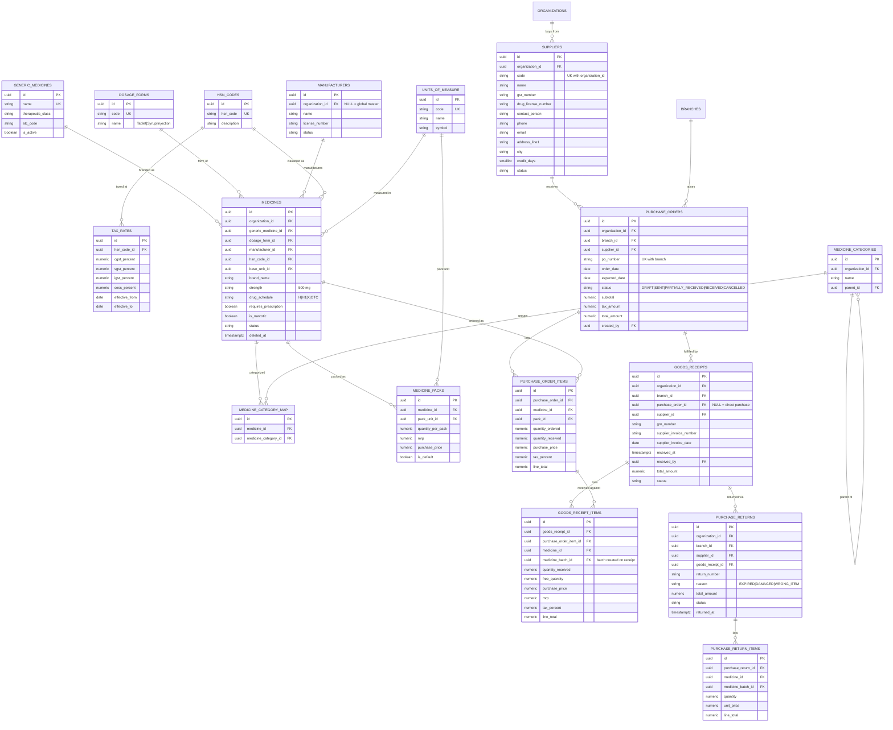
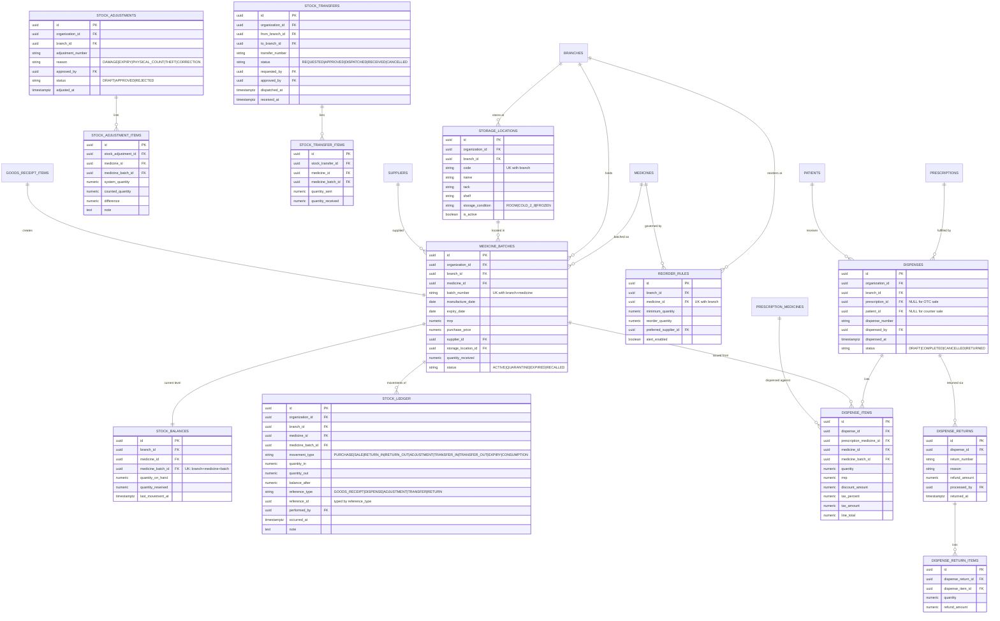
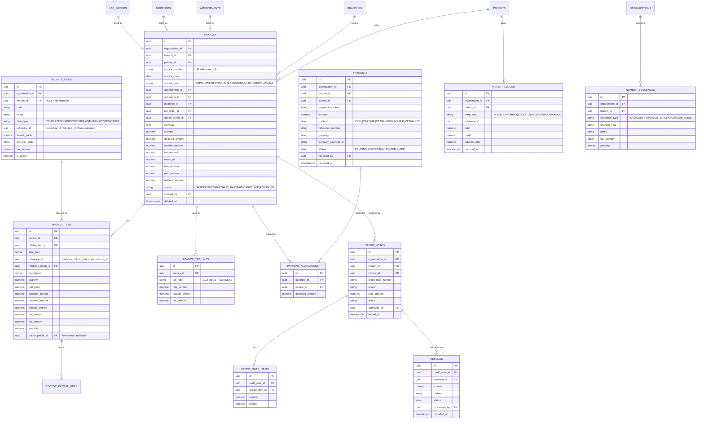
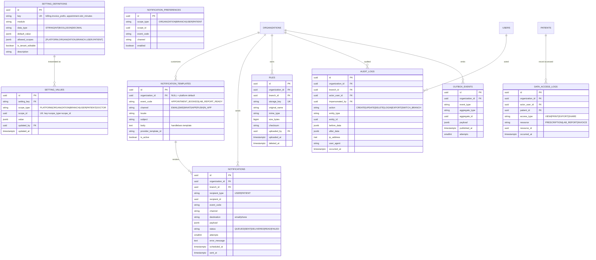

# Healthcare SaaS — Database Design (v1)

Multi-tenant, subdomain-routed clinic/hospital management platform.
PostgreSQL 16. Target: a schema that absorbs new _features_ without new _shapes_.

---

## 1. The five decisions everything else follows from

### D1 — Organization is the tenant. Branch is the place.

A single-location clinic and a 3-branch hospital are the **same shape**: one `organization` with one or three `branches`. There is no separate "clinic" concept.

- `alpha.xyz.com` → `organizations.slug = 'alpha'`
- PMCS with branches A/B/C → one org `pmcs`, three `branches` rows
- A clinic that later opens a second location adds a row. No migration.

Every operational table carries `organization_id`. Tables describing something that happens _at a location_ also carry `branch_id`.

### D2 — One `users` table. Roles live on the membership, not the person.

`users` = one login, globally unique email/phone. Everything role-shaped is:

```
memberships          user  ×  organization        (the person belongs to this org)
membership_roles     membership × role × branch_id NULLABLE
```

`branch_id NULL` means **all branches in the org**. This one nullable column is the entire branch-assignment requirement:

| Requirement                                            | Rows in `membership_roles`                         |
| ------------------------------------------------------ | -------------------------------------------------- |
| One admin for all three branches                       | 1 row, `role=ADMIN`, `branch_id=NULL`              |
| A separate admin per branch                            | 3 memberships, each 1 row with its own `branch_id` |
| Admin X manages A+B, admin Y manages A                 | X: 2 rows (A, B). Y: 1 row (A).                    |
| Dr. Sharma: doctor at A, and also front-desk lead at C | 2 rows, different `role_id` + `branch_id`          |
| Doctor working across two different organizations      | 2 memberships (one per org), same `users` row      |

**Branch switching** = the session's `active_branch_id` changes. The UI branch picker is literally `SELECT branch FROM membership_roles WHERE membership.user_id = me`. Super admin (`users.is_platform_admin`) bypasses membership and can impersonate any org/branch — every such switch is written to `audit_logs`.

### D3 — Tenant isolation is enforced by the database, not by the ORM.

Two mechanisms, both non-optional:

1. **Composite foreign keys.** Child tables reference `(organization_id, id)` of the parent, not just `id`:

   ```sql
   ALTER TABLE appointments
     ADD CONSTRAINT fk_appt_patient
     FOREIGN KEY (organization_id, patient_id)
     REFERENCES patients (organization_id, id);
   ```

   It becomes physically impossible to attach org B's patient to org A's appointment — the class of bug the current schema has no defense against.

2. **Row-level security.** Every tenant table gets:
   ```sql
   ALTER TABLE appointments ENABLE ROW LEVEL SECURITY;
   CREATE POLICY tenant_isolation ON appointments
     USING (organization_id = current_setting('app.current_org')::uuid);
   CREATE POLICY branch_isolation ON appointments
     USING (branch_id = ANY (current_setting('app.branch_scope')::uuid[]));
   ```
   The app sets `app.current_org` / `app.branch_scope` / `app.current_user` per request from the session. A forgotten `WHERE clinic_id = ?` returns zero rows instead of another clinic's patients.

"A doctor logged into clinic XYZ sees only XYZ data" is therefore not application logic — it's the connection's identity.

### D4 — Nothing is stored as a JSON array of IDs.

The `tooth_diagno.problem_ids` / `hair_diagno.diagnosis_ids` pattern is replaced by real join tables. Where genuine per-specialty variability exists (dental charting vs. trichology vs. dermatology), it is handled by **versioned form templates** (`clinical_form_templates.schema` + `clinical_form_submissions.data`) — JSONB as a _document_, never as a foreign key. Dental charting additionally gets a first-class relational table because tooth-level history must be queryable.

### D5 — One billing spine.

One `invoices` table with typed `invoice_items` covering consultations, procedures, lab tests and pharmacy dispensing. Not two invoice systems, and never a JSON blob of line items. Platform subscription billing is a completely separate set of tables (`subscription_invoices`) — a clinic's revenue and the clinic's bill to you must never share a table.

---

## 2. Conventions (apply to every table)

| Concern     | Rule                                                                                                                                               |
| ----------- | -------------------------------------------------------------------------------------------------------------------------------------------------- |
| PK          | `id uuid PRIMARY KEY DEFAULT uuidv7()` — time-sortable, index-friendly                                                                             |
| Tenant      | `organization_id uuid NOT NULL` on every tenant table; `branch_id` where location-scoped                                                           |
| Audit       | `created_at`, `updated_at timestamptz NOT NULL DEFAULT now()`, `created_by`, `updated_by uuid`                                                     |
| Soft delete | `deleted_at timestamptz NULL`. Never `is_deleted boolean` (loses _when_, and `NULL` indexes are cheap: partial indexes `WHERE deleted_at IS NULL`) |
| Money       | `numeric(14,2)` + explicit `currency char(3)`. Never float.                                                                                        |
| Quantities  | `numeric(14,3)` (0.5 tablet is real)                                                                                                               |
| Timestamps  | `timestamptz` always, stored UTC; `branches.timezone` for display                                                                                  |
| Enums       | Postgres `ENUM` for closed sets (`appointment_status`); lookup tables for anything a tenant may extend (specialties, symptoms)                     |
| Naming      | `snake_case`, plural tables, `<singular>_id` FKs                                                                                                   |
| Uniqueness  | Always tenant-qualified: `UNIQUE (organization_id, code)`, never bare `code`                                                                       |
| Documents   | Metadata in `files`; binaries in object storage. Domain tables link to `files.id`.                                                                 |

Schemas (namespaces): `platform`, `iam`, `org`, `patient`, `clinical`, `lab`, `pharmacy`, `inventory`, `billing`, `ops`.

---

## 3. ERD — Platform, tenancy & subscriptions



**Entitlement check** is one resolution order: `subscription_feature_overrides` → `plan_features` → hard default. `usage_counters` enforces `max_branches` / `max_users` at write time.

---

## 4. ERD — Identity, roles & permissions

```mermaid
erDiagram
  USERS {
    uuid id PK
    string email UK "global"
    string phone UK "global"
    string password_hash
    string full_name
    string avatar_file_id FK
    string status "INVITED|ACTIVE|SUSPENDED|LOCKED"
    boolean is_platform_admin "seeded super admin"
    boolean mfa_enabled
    string mfa_secret
    timestamptz email_verified_at
    timestamptz phone_verified_at
    timestamptz last_login_at
    timestamptz deleted_at
  }
  USER_IDENTITIES {
    uuid id PK
    uuid user_id FK
    string provider "GOOGLE|MICROSOFT|SAML"
    string provider_uid UK "unique with provider"
  }
  SESSIONS {
    uuid id PK
    uuid user_id FK
    uuid active_organization_id FK "branch switching lives here"
    uuid active_branch_id FK
    uuid impersonated_by_user_id FK "super-admin drill-down"
    string refresh_token_hash
    inet ip_address
    string user_agent
    timestamptz expires_at
    timestamptz revoked_at
  }
  AUTH_TOKENS {
    uuid id PK
    uuid user_id FK
    string purpose "LOGIN_OTP|RESET|VERIFY_EMAIL|VERIFY_PHONE"
    string identifier "email or phone"
    string code_hash
    smallint attempts
    timestamptz expires_at
    timestamptz consumed_at
  }
  MEMBERSHIPS {
    uuid id PK
    uuid user_id FK
    uuid organization_id FK "UK with user_id"
    string status "INVITED|ACTIVE|SUSPENDED"
    uuid invited_by FK
    timestamptz joined_at
    timestamptz deleted_at
  }
  ROLES {
    uuid id PK
    uuid organization_id FK "NULL = system role"
    string code "UK with organization_id"
    string name
    string scope_level "PLATFORM|ORGANIZATION|BRANCH"
    boolean is_system "not editable by tenant"
    string description
  }
  PERMISSIONS {
    uuid id PK
    string code UK "appointment.create, pharmacy.stock.adjust"
    string module
    string action
    string description
  }
  ROLE_PERMISSIONS {
    uuid id PK
    uuid role_id FK
    uuid permission_id FK
  }
  MEMBERSHIP_ROLES {
    uuid id PK
    uuid membership_id FK
    uuid role_id FK
    uuid branch_id FK "NULL = every branch in the org"
    timestamptz valid_from
    timestamptz valid_to
  }
  MEMBERSHIP_PERMISSION_OVERRIDES {
    uuid id PK
    uuid membership_id FK
    uuid permission_id FK
    uuid branch_id FK "NULL = org-wide"
    string effect "GRANT|DENY"
    string reason
  }
  INVITATIONS {
    uuid id PK
    uuid organization_id FK
    string email
    uuid role_id FK
    string token UK
    uuid invited_by FK
    timestamptz expires_at
    timestamptz accepted_at
  }
  INVITATION_BRANCHES {
    uuid id PK
    uuid invitation_id FK
    uuid branch_id FK
  }
  STAFF_PROFILES {
    uuid id PK
    uuid membership_id FK,UK
    string employee_code
    string department
    date joined_on
    date relieved_on
  }

  USERS ||--o{ USER_IDENTITIES : "authenticates via"
  USERS ||--o{ SESSIONS : "opens"
  USERS ||--o{ AUTH_TOKENS : "verifies with"
  USERS ||--o{ MEMBERSHIPS : "belongs to org via"
  ORGANIZATIONS ||--o{ MEMBERSHIPS : "has members"
  ORGANIZATIONS ||--o{ ROLES : "defines custom"
  ROLES ||--o{ ROLE_PERMISSIONS : "grants"
  PERMISSIONS ||--o{ ROLE_PERMISSIONS : "granted by"
  MEMBERSHIPS ||--o{ MEMBERSHIP_ROLES : "assigned"
  ROLES ||--o{ MEMBERSHIP_ROLES : "assigned as"
  BRANCHES ||--o{ MEMBERSHIP_ROLES : "scoped to"
  MEMBERSHIPS ||--o{ MEMBERSHIP_PERMISSION_OVERRIDES : "adjusted by"
  PERMISSIONS ||--o{ MEMBERSHIP_PERMISSION_OVERRIDES : "adjusted"
  MEMBERSHIPS ||--o| STAFF_PROFILES : "employs"
  ORGANIZATIONS ||--o{ INVITATIONS : "sends"
  INVITATIONS ||--o{ INVITATION_BRANCHES : "for branches"
  ORGANIZATIONS ||--o{ BRANCHES : "operates"
```



**Effective permission** for `(user, org, branch, permission)`:

```
DENY override           → denied
GRANT override          → allowed
role_permissions where membership_role.branch_id IN (branch, NULL) → allowed
otherwise               → denied
```

Seed system roles: `SUPER_ADMIN` (platform), `ORG_OWNER`, `ORG_ADMIN`, `BRANCH_ADMIN`, `DOCTOR`, `NURSE`, `RECEPTIONIST`, `FRONT_DESK`, `LAB_ASSISTANT`, `LAB_MANAGER`, `PHARMACIST`, `ACCOUNTANT`, `PATIENT`. Tenants clone these into custom roles — they never mutate `is_system` rows.

---

## 5. ERD — Doctors

A doctor is a `users` row with a `doctor_profiles` row. Practising at three branches = three `membership_roles`. Fees and schedules are **per branch**, which is why they are separate tables and not columns on the doctor.



`specialties.parent_id` collapses the current `specialties` / `sub_specialties` / `specialization_map` triple into one self-referencing master.

---

## 6. ERD — Patients

Patient records are **organization-scoped**, not global — one org must not read another's patient list, and cross-org linkage is a consent problem, not a schema convenience. Within an org, a patient registers at each branch they visit via `patient_registrations`, which carries the branch-local MRN. Choosing a clinic in the UI = filtering on that registration.

```mermaid
erDiagram
  PATIENTS {
    uuid id PK
    uuid organization_id FK
    string uhid "UK with organization_id"
    uuid user_id FK "NULL until portal signup"
    string first_name
    string last_name
    date date_of_birth
    string gender
    string blood_group
    string phone
    string email
    string abha_number
    string national_id
    string marital_status
    string status
    timestamptz deleted_at
  }
  PATIENT_REGISTRATIONS {
    uuid id PK
    uuid organization_id FK
    uuid patient_id FK
    uuid branch_id FK "UK with patient_id"
    string mrn "branch-local record number"
    timestamptz registered_at
    uuid registered_by FK
    string status "ACTIVE|INACTIVE"
  }
  PATIENT_ADDRESSES {
    uuid id PK
    uuid patient_id FK
    string address_type "HOME|WORK|OTHER"
    string line1
    string line2
    string city
    string state
    string pincode
    string country_code
    boolean is_primary
  }
  PATIENT_CONTACTS {
    uuid id PK
    uuid patient_id FK
    string relation
    string name
    string phone
    boolean is_emergency
    boolean is_guardian
  }
  PATIENT_ALLERGIES {
    uuid id PK
    uuid patient_id FK
    string allergen_type "DRUG|FOOD|ENVIRONMENT"
    uuid medicine_id FK "NULL if non-drug"
    string allergen_text
    string severity "MILD|MODERATE|SEVERE"
    date noted_on
    uuid noted_by FK
  }
  PATIENT_CONDITIONS {
    uuid id PK
    uuid patient_id FK
    uuid diagnosis_id FK
    string status "ACTIVE|RESOLVED|CHRONIC"
    date onset_date
    date resolved_date
    text note
  }
  PATIENT_MEDICATIONS {
    uuid id PK
    uuid patient_id FK
    uuid medicine_id FK
    string medicine_text
    string dosage
    date started_on
    date stopped_on
    boolean is_ongoing
  }
  PATIENT_FAMILY_HISTORY {
    uuid id PK
    uuid patient_id FK
    string relation
    uuid diagnosis_id FK
    text note
  }
  PATIENT_INSURANCES {
    uuid id PK
    uuid patient_id FK
    string payer_name
    string policy_number
    string plan_name
    numeric coverage_amount
    date valid_from
    date valid_to
    boolean is_active
  }
  PATIENT_DOCUMENTS {
    uuid id PK
    uuid patient_id FK
    uuid file_id FK
    string document_type "ID_PROOF|REPORT|SCAN|CONSENT|OTHER"
    string title
    uuid uploaded_by FK
  }
  CONSENT_DEFINITIONS {
    uuid id PK
    uuid organization_id FK "NULL = platform-wide"
    string code
    string version
    string title
    text body
    boolean is_active
  }
  PATIENT_CONSENTS {
    uuid id PK
    uuid patient_id FK
    uuid consent_definition_id FK
    string channel "WEB|SMS|WHATSAPP|PAPER|IN_APP"
    boolean granted
    timestamptz granted_at
    timestamptz revoked_at
    inet ip_address
    uuid evidence_file_id FK
  }

  ORGANIZATIONS ||--o{ PATIENTS : "owns records of"
  PATIENTS ||--o{ PATIENT_REGISTRATIONS : "registered at"
  BRANCHES ||--o{ PATIENT_REGISTRATIONS : "registers"
  USERS ||--o| PATIENTS : "portal login for"
  PATIENTS ||--o{ PATIENT_ADDRESSES : "lives at"
  PATIENTS ||--o{ PATIENT_CONTACTS : "next of kin"
  PATIENTS ||--o{ PATIENT_ALLERGIES : "allergic to"
  PATIENTS ||--o{ PATIENT_CONDITIONS : "diagnosed with"
  PATIENTS ||--o{ PATIENT_MEDICATIONS : "takes"
  PATIENTS ||--o{ PATIENT_FAMILY_HISTORY : "family"
  PATIENTS ||--o{ PATIENT_INSURANCES : "covered by"
  PATIENTS ||--o{ PATIENT_DOCUMENTS : "has"
  PATIENTS ||--o{ PATIENT_CONSENTS : "consents"
  CONSENT_DEFINITIONS ||--o{ PATIENT_CONSENTS : "consented to"
```



The current single-row `patient_medical_history` with a free-text `allergies` column is replaced by four queryable tables — drug-allergy interaction checking is impossible against a text blob.

---

## 7. ERD — Scheduling & clinical encounters

`appointment` (a booking) and `encounter` (the clinical event) are separated. A walk-in has an encounter with no appointment; a no-show has an appointment with no encounter.



Adding an ophthalmology module later = inserting one `clinical_form_templates` row. No DDL. That is the extension point that keeps this schema stable.

---

## 8. ERD — Laboratory



The current schema stores a lab report as a single URL with no parameters — a CBC has 20+ measured values. `lab_test_parameters` + `lab_results` makes trending a patient's hemoglobin over two years a query instead of a PDF hunt.

---

## 9. ERD — Pharmacy catalogue & procurement



`medicines` is **one** master (the current `care.medicines` legacy table is dropped). `tax_rates` is date-versioned because GST slabs change and historical invoices must reprint correctly.

---

## 10. ERD — Inventory & dispensing



Three things the current schema lacks entirely, all of which cause real money loss:

- **`stock_balances`** — a materialized current level per batch. Without it, "what's in stock" is a full ledger scan. Maintained by trigger on `stock_ledger` insert, inside the same transaction.
- **`stock_ledger.balance_after`** — makes the ledger auditable and self-verifying.
- **Expiry management** — driven off `medicine_batches.expiry_date` with a partial index `WHERE status='ACTIVE' AND expiry_date <= now() + interval '90 days'`. Batch selection at dispense is FEFO (first-expiry-first-out) against `stock_balances`.

`stock_ledger.reference_id` is the one deliberate polymorphic column in the design — it points at whichever document caused the movement. It is constrained by `CHECK` on `reference_type` and indexed on `(reference_type, reference_id)`, and it is _never_ joined for correctness (the ledger is self-contained), only for drill-down.

---

## 11. ERD — Billing & revenue



`payment_allocations` (rather than `payments.invoice_id`) supports the real cases: one payment covering three invoices, and advance payments applied later. `number_sequences` generalizes the current per-clinic invoice counter to every document type and adds financial-year reset — required for GST compliance.

---

## 12. ERD — Settings, notifications & audit



**Settings resolution** — the granularity you asked for falls out of one lookup, most specific wins:

```
USER/PATIENT value → BRANCH value → ORGANIZATION value → PLATFORM value → definition default
```

Adding a new setting is an `INSERT` into `setting_definitions`. No migration, no new column, and the same mechanism serves clinic-level and doctor-level preferences.

`audit_logs` and `data_access_logs` should be `PARTITION BY RANGE (occurred_at)` monthly from day one — retrofitting partitioning onto a large table is painful.

---

## 13. Dashboard queries this schema makes cheap

| Dashboard tile               | Query shape                                                                                                                 |
| ---------------------------- | --------------------------------------------------------------------------------------------------------------------------- |
| Total doctors in clinic      | `membership_roles` ⋈ `roles` where `role.code='DOCTOR'` and `branch_id IN (branch, NULL)`                                   |
| Total patients in clinic     | `count(*) FROM patient_registrations WHERE branch_id = ?`                                                                   |
| Appointments (today / range) | `appointments` on `(branch_id, scheduled_start)` — covering index                                                           |
| Earnings so far              | `sum(total_amount)` / `sum(paid_amount)` FROM `invoices` WHERE `branch_id` — one table, because there is one invoice system |
| Revenue by doctor            | `invoice_items.doctor_profile_id` — attribution is on the line, not inferred                                                |
| Revenue by module            | `invoice_items.item_type` group-by                                                                                          |
| Stock value / expiring soon  | `stock_balances ⋈ medicine_batches` on `expiry_date`                                                                        |
| Pending lab reports          | `lab_orders` where `status IN ('ORDERED','IN_PROGRESS')`                                                                    |
| Outstanding dues             | `sum(balance_amount) FROM invoices WHERE status IN ('ISSUED','PARTIALLY_PAID')`                                             |

For an org-wide (all-branches) view the super admin or org admin simply widens `app.branch_scope`. Same queries, no code fork.

Roll-ups: a `daily_branch_metrics` summary table refreshed nightly (branch_id, metric_date, appointment counts by status, new patients, gross revenue, collections, dispense count, stock value). Dashboards read the summary; drill-downs hit the live tables.

---

## 14. Indexing baseline

```sql
-- every tenant table
CREATE INDEX ON <table> (organization_id, branch_id) WHERE deleted_at IS NULL;

-- hot paths
CREATE INDEX ON appointments (branch_id, scheduled_start DESC) WHERE deleted_at IS NULL;
CREATE INDEX ON appointments (doctor_profile_id, scheduled_start);
CREATE INDEX ON appointments (patient_id, scheduled_start DESC);
CREATE UNIQUE INDEX ON patients (organization_id, uhid);
CREATE UNIQUE INDEX ON patient_registrations (patient_id, branch_id);
CREATE INDEX ON patients USING gin (
  (first_name || ' ' || last_name || ' ' || phone) gin_trgm_ops);  -- name/phone search
CREATE INDEX ON stock_ledger (branch_id, medicine_id, occurred_at DESC);
CREATE UNIQUE INDEX ON stock_balances (branch_id, medicine_id, medicine_batch_id);
CREATE INDEX ON medicine_batches (branch_id, expiry_date)
  WHERE status = 'ACTIVE';
CREATE UNIQUE INDEX ON invoices (branch_id, invoice_number);
CREATE INDEX ON invoices (branch_id, invoice_date DESC, status);
CREATE INDEX ON membership_roles (membership_id, branch_id);
CREATE INDEX ON audit_logs (organization_id, entity_type, entity_id, occurred_at DESC);
```

Two exclusion constraints worth adding early (they prevent double-booking at the database level):

```sql
ALTER TABLE appointments ADD CONSTRAINT no_doctor_overlap
  EXCLUDE USING gist (
    doctor_profile_id WITH =,
    tstzrange(scheduled_start, scheduled_end) WITH &&
  ) WHERE (status NOT IN ('CANCELLED','NO_SHOW'));
```

---

## 15. What was deliberately left out, and why

| Not modeled                                | Reason                                                                                                                                                                                                               |
| ------------------------------------------ | -------------------------------------------------------------------------------------------------------------------------------------------------------------------------------------------------------------------- |
| IPD / bed management, OT scheduling        | `encounters.encounter_type='IPD'` is the hook; the ward/bed/admission tables are a self-contained additive module. Say the word and I'll add them.                                                                   |
| Insurance claim lifecycle (TPA, pre-auth)  | `patient_insurances` captures the policy; claims adjudication is its own subsystem.                                                                                                                                  |
| ABDM / ABHA integration tables             | Deliberately kept to `patients.abha_number` + `patient_consents`. The current schema's four ABDM session tables are integration scratch state — that belongs in Redis, not Postgres.                                 |
| Per-tenant schemas or per-tenant databases | Shared schema + RLS scales to thousands of tenants without migration fan-out. Revisit only if a single tenant needs physical isolation for compliance; the `organization_id` column makes extraction possible later. |
| Physical `deleted` archival                | Soft delete + partitioned audit covers retention; add archival jobs when volume demands.                                                                                                                             |

---

## 16. Build order

1. `organizations`, `branches`, `users`, `memberships`, `roles`, `permissions`, `membership_roles` — plus RLS policies and the session GUC plumbing. **Nothing else starts until branch switching and permission checks work end to end.**
2. `plans`, `subscriptions`, entitlement resolution.
3. `patients`, `patient_registrations`, `appointments`, `encounters`.
4. `prescriptions` + masters + `clinical_form_templates`.
5. `billable_items`, `invoices`, `payments`, `number_sequences`.
6. Pharmacy catalogue → inventory → dispensing (this order; dispensing depends on batches).
7. Lab.
8. `setting_definitions`/`setting_values`, notifications, audit — cross-cutting, but seed `setting_definitions` from step 1.
9. `daily_branch_metrics` + dashboard.
