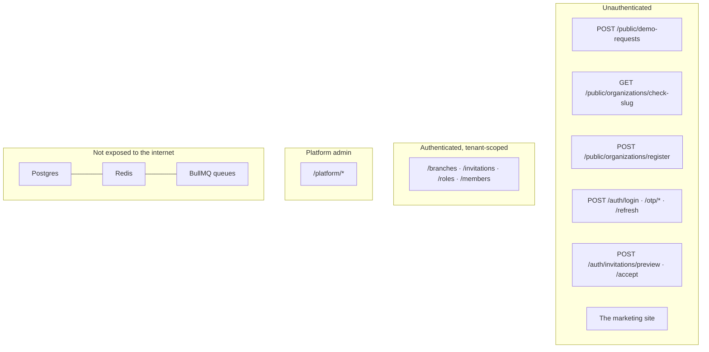

# Threat Model

**Status:** _Inferred._ No formal threat-modelling exercise has been performed
and no penetration test has been run. This is a structured reading of the code,
written so a future session has something to argue with rather than a blank
page.

---

## Assets, ranked

| #   | Asset                                             | Why it ranks here                                                      | Exists today?       |
| --- | ------------------------------------------------- | ---------------------------------------------------------------------- | ------------------- |
| 1   | Patient clinical records                          | PHI. A cross-tenant leak is reportable under DPDP and ends the company | **No** — Phase 3    |
| 2   | Patient identity (name, phone, ABHA, national id) | Sensitive personal data, and the join key to everything else           | **No**              |
| 3   | Credentials and session material                  | Compromise grants everything below it                                  | Yes                 |
| 4   | The tenant boundary itself                        | Not data, but the property every clinic buys                           | Yes                 |
| 5   | Clinic commercial data — pricing, revenue, stock  | Competitively sensitive between tenants                                | **No** — Phases 4–5 |
| 6   | Staff identity and roles                          | Escalation path to everything above                                    | Yes                 |
| 7   | The customer list — which clinics use rcln        | Commercially sensitive; leaks via subdomain existence                  | Yes                 |
| 8   | Audit trail integrity                             | The record you rely on _after_ an incident                             | Yes                 |

The system currently holds assets 3, 4, 6, 7 and 8. The highest-value assets do
not exist yet — which is exactly why the controls are being built first.

---

## Actors

| Actor                         | Capability                                                                           | Trust                  |
| ----------------------------- | ------------------------------------------------------------------------------------ | ---------------------- |
| Anonymous internet            | Public endpoints: demo form, slug check, registration, login, OTP, invitation accept | None                   |
| Authenticated tenant member   | Their organization, their permissions, their branches                                | Partial                |
| Tenant admin                  | Full organization, can define roles and grant them                                   | High within one tenant |
| Platform admin                | **All 83 permissions across every organization.** Bypasses all three IAM guards      | Total                  |
| Compromised dependency        | Whatever the process can do                                                          | None                   |
| Operator with database access | Everything, RLS included if connecting as owner                                      | Total                  |

**The platform admin is the largest single point of trust in the system**, and
there is no MFA on that account.

---

## Attack surfaces

---

## Threats and mitigations

### T1 · Cross-tenant data access — _the one that matters_

**Mitigated, in depth.** Three independent layers, a role split,
`assertRlsActive()`, a CI gate, and 17 test cases. See
[Tenant_Isolation](Tenant_Isolation.md).

**Residual:** a new table shipped without a policy is caught by `db:rls:check`
only if the check runs. It is in CI and in the pre-push hook.

### T2 · Privilege escalation within a tenant

**Partially mitigated.** Three application-level guards, no database
enforcement. An org admin cannot mint themselves `billing.manage` _through the
API_. Direct SQL, a future service that forgets the guards, or a bug in
`authorize()` all bypass them.

**Severity: High.** This is the top-ranked outstanding security item.

### T3 · Credential attacks

**Well mitigated.** Argon2id, per-identifier and per-phone rate limits, 5-attempt
lockout, uniform constant-time failure with a dummy hash for absent users, OTP
hashed and attempt-capped.

**Residual:** no MFA anywhere, including for platform admins. No credential
breach-list checking. No password-strength policy verified in this review.

### T4 · Session theft and replay

**Well mitigated.** Refresh rotation with family revocation on reuse; refresh
tokens stored only as hashes; httpOnly host-only cookies so browser JS never
holds a token; 15-minute access tokens.

**Residual:** a stolen access token is valid for up to 15 minutes and cannot be
revoked. That is a deliberate, documented trade-off.

### T5 · Customer-list enumeration

**Partially mitigated.** Unknown tenant → 404 not 403; login does not
distinguish "not a member here"; the slug check returns a boolean and is
rate-limited hard.

**Residual:** the slug-availability endpoint is an oracle by construction. DNS
for a wildcard domain also reveals nothing, but a determined attacker can probe
subdomains through the 404/200 distinction on the marketing site. Accepted.

### T6 · Injection

**Mitigated.** Zod at every boundary; Prisma parameterises; the RLS SQL uses
`format('%I')` with literal table names. No user input reaches `$queryRaw`.

### T7 · Supply chain

**Not mitigated.** No Dependabot, no `pnpm audit` in CI, no container image
scanning, no lockfile-integrity policy beyond `--frozen-lockfile`. The
repository has good instincts about _adding_ dependencies; it has no process for
the ones already there.

### T8 · Insider and operator access

**Not mitigated.** No break-glass procedure, no database access logging, no
separation between "can deploy" and "can read production data". Nothing is
deployed, so this is a decision still to make rather than a gap to close.

### T9 · Audit tampering

**Weakly mitigated.** Audit rows commit with their change, which prevents
divergence. Nothing prevents a later `UPDATE` or `DELETE` — append-only is a
convention.

### T10 · Denial of service

**Partially mitigated.** Redis-backed rate limits across every sensitive
surface, 1 MB body limit, compression. No WAF, no CDN, no bot management — all
specified in the target design and not deployed.

### T11 · PHI exposure through side channels

**Mitigated by convention.** No PHI in logs (pino redaction), Redis, cookies,
`localStorage` or query params.

**Residual:** enforced by review, not by tooling. A lint rule or a log-scanning
test would make it real. No PHI exists yet, so the convention has never been
tested against actual data.

---

## What is explicitly out of scope

- **HIPAA.** Irrelevant unless selling to US customers; recorded as a deliberate
  non-goal in `Architecture/architecture.md` §13.
- **Cross-tenant SSO.** Host-only cookies make it impossible, on purpose.
- **Patient-facing threat surface.** The portal does not exist.

---

## What would most improve this posture

In order of value per unit of effort:

1. **MFA for platform admins.** `otplib` is already installed. One account
   compromise currently means every tenant's data.
2. **Move the IAM guards into the database** as RESTRICTIVE policies or
   triggers, for the two of three that can be.
3. **`data_access_logs`** — before patient data exists, not after.
4. **Dependency and image scanning in CI.** Cheap, and currently absent.
5. **A tamper-evident audit log** — append-only constraint or hash chain.
6. **Implement the anonymisation routine** the legal pages already promise.
